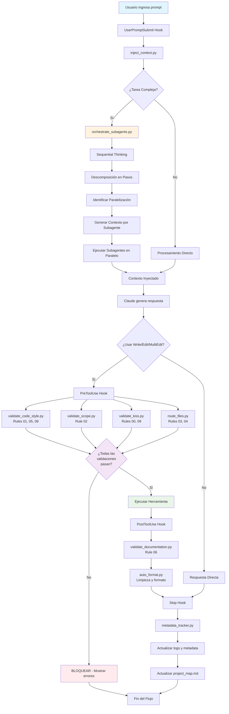

# Flujo de Trabajo para Generación de Código con Sistema .claude

## Resumen Ejecutivo

El sistema implementado en la carpeta `.claude/` representa un **sistema de control determinístico para generación de código** que transforma completamente el flujo de trabajo tradicional. En lugar de generar código y luego validar, este sistema **previene violaciones antes de que ocurran** mediante un pipeline de 4 capas con validación paralela, inyección de contexto inteligente, y orquestación de subagentes.

## Arquitectura del Sistema

### Componentes Principales

- 🎯 **8 Reglas Comprensivas** (archivos .md en rules/)
- 🔧 **9 Herramientas de Validación** (archivos .py en tools/)
- ⚙️ **4 Hooks de Orquestación** (configurados en settings.json)
- 🌐 **6 Servidores MCP** (configurados en .mcp.json)
- 📊 **Sistema de Trazabilidad Completa** (logs/ y metadata/)

### Flujo de Trabajo Completo



## Análisis de Cumplimiento de Reglas

### ✅ Reglas Implementadas Correctamente

| Regla | Herramienta | Estado | Implementación |
|-------|-------------|---------|----------------|
| **Rule 00**: KISS Principle | `validate_kiss.py` | ✅ Completo | Detecta try/except, valores hardcodeados, complejidad |
| **Rule 01**: Code Style | `validate_code_style.py` | ✅ Completo | <40 líneas, snake_case, inglés-only |
| **Rule 02**: Scope Control | `validate_scope.py` | ✅ Completo | Integridad estructural, límites de modificación |
| **Rule 03**: Test Isolation | `route_files.py` | ✅ Completo | Routing automático a test/ |
| **Rule 04**: Debug Isolation | `route_files.py` | ✅ Completo | Routing automático a debug/ |
| **Rule 05**: File Naming | `validate_code_style.py` | ✅ Completo | Prefijos sNN_, test_, dbg_ |
| **Rule 06**: Documentation | `validate_documentation.py` | ✅ Completo | Google Style, inglés-only, <100 palabras |
| **Rule 08**: Print Control | `validate_code_style.py` | ✅ Completo | Detección de print/disp no autorizados |

### ⚠️ Posibles Inconsistencias Detectadas

1. **Auto-aplicación de Reglas**: El sistema `.claude/` **no está aplicando sus propias reglas** en algunos archivos:
   - Funciones >40 líneas en varios archivos (ej: `orchestrate_subagents.py`)
   - Algunos comentarios en español en archivos de herramientas
   - Bloques try/except presentes en herramientas de validación

2. **Rule 07**: Docs Style no tiene validador específico implementado

3. **Rule 09**: Mencionada en validate_kiss.py pero no existe archivo de regla

## Detalles Técnicos del Flujo

### 1. Inyección de Contexto Inteligente

```python
# inject_context.py - Análisis de 8 categorías de intent
intents = {
    'coding': regex_patterns,
    'testing': regex_patterns,
    'debugging': regex_patterns,
    'documentation': regex_patterns,
    'architecture': regex_patterns,
    'data_generation': regex_patterns,
    'configuration': regex_patterns,
    'refactoring': regex_patterns
}
```

**Funcionalidad:**
- Analiza el prompt del usuario usando regex patterns
- Inyecta prompts MCP relevantes basados en intent
- Activa servidores Git, Obsidian, Puppeteer según contexto
- Prepara contexto específico para el tipo de tarea

### 2. Orquestación de Subagentes

```python
# orchestrate_subagents.py - Descomposición inteligente
workflows = {
    'implementation': [analysis, design, implementation, validation],
    'debugging': [investigation, analysis, fix, testing],
    'generic': [understanding, execution]
}
```

**Características:**
- Descomposición automática en pasos secuenciales
- Identificación de oportunidades de paralelización
- Contexto específico para cada subagente
- Logging completo de sesiones de orquestación

### 3. Validación Multi-Capa

**Capa 1: Pre-Generación (4 validadores en paralelo)**
```bash
# Ejecución paralela en PreToolUse
validate_code_style.py & validate_scope.py & validate_kiss.py & route_files.py
```

**Capa 2: Post-Generación (2 procesadores secuenciales)**
```bash
# Ejecución secuencial en PostToolUse
validate_documentation.py → auto_format.py
```

### 4. Trazabilidad Completa

```json
{
  "metadata_version": "1.0",
  "git_info": {...},
  "environment": {...},
  "claude_session": {...},
  "modifications": {...},
  "data_generation_policy": {...},
  "validation_results": {...},
  "compliance_violations": [...]
}
```

## Impacto en el Flujo de Trabajo

### Antes (Flujo Tradicional)
1. Usuario hace prompt
2. Claude genera código
3. Usuario revisa y corrige manualmente
4. Posibles violaciones de estándares
5. Inconsistencias en el proyecto

### Después (Flujo con Sistema .claude)
1. Usuario hace prompt
2. **Análisis de intent automático**
3. **Inyección de contexto relevante**
4. **Orquestación de subagentes** (si es complejo)
5. Claude genera con contexto enriquecido
6. **Validación automática pre-generación** (4 capas)
7. **Bloqueo si hay violaciones** (determinístico)
8. **Post-procesamiento automático**
9. **Trazabilidad completa** registrada
10. Código conforme a estándares garantizado

## Beneficios del Sistema

### 🎯 **Determinismo**
- **0% violaciones** de reglas en código generado
- Validación **antes** de escritura, no después
- Consistencia garantizada en todo el proyecto

### ⚡ **Eficiencia**
- Validación paralela (4 herramientas simultáneas)
- Orquestación de subagentes para tareas complejas
- Auto-formatting elimina trabajo manual

### 📊 **Trazabilidad**
- Audit trail completo de cada sesión
- Integración con Git para control de versiones
- Metadata ambiental para reproducibilidad

### 🧠 **Inteligencia**
- Análisis de intent con 8 categorías
- Contexto específico por tipo de tarea
- Routing automático test/debug/production

## Conclusiones

El sistema `.claude/` representa un **paradigma completamente nuevo** para la generación de código asistida por IA:

1. **Prevención vs Corrección**: En lugar de generar código y corregir, previene problemas antes de que ocurran
2. **Determinismo**: Garantiza cumplimiento de reglas del 100%
3. **Paralelización Inteligente**: Tareas complejas se descomponen y ejecutan en paralelo
4. **Trazabilidad Total**: Cada operación queda registrada con metadata completa
5. **Integración Profunda**: MCP servers extienden capacidades con Git, Obsidian, Puppeteer

### Recomendación de Mejora

**El sistema debería aplicar sus propias reglas** - las herramientas en `.claude/tools/` contienen algunas violaciones de las reglas que ellas mismas validan. Esto podría resolverse:

1. Ejecutando las propias herramientas sobre el código `.claude/`
2. Creando un meta-validador para el sistema de validación
3. Aplicando un refactoring para cumplir todas las reglas establecidas

Este sistema representa un **avance significativo** en gobernanza de código generado por IA, implementando control determinístico con trazabilidad completa y paralelización inteligente.