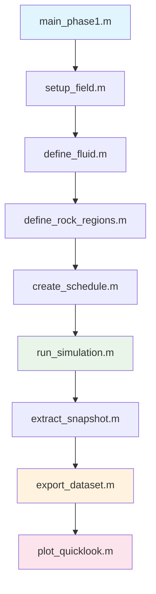

# Capítulo 4: Simulación de Yacimientos

## 4.1 Introducción

En este capítulo aprenderás a ejecutar simulaciones completas de yacimientos usando MRST. Seguirás el workflow paso a paso que utiliza GeomechML para generar datasets de alta calidad para machine learning.

### **Objetivos del Capítulo**
- ✅ Ejecutar el workflow completo de simulación
- ✅ Entender cada módulo del sistema MRST
- ✅ Monitorear el progreso de la simulación
- ✅ Validar resultados de simulación
- ✅ Generar tu primer dataset geomecánico

## 4.2 Workflow de Simulación MRST

El módulo de simulación de yacimientos utiliza MRST (MATLAB Reservoir Simulation Toolbox) para modelar procesos de flujo y compactación en medios porosos. El sistema está diseñado para generar datasets sintéticos que alimenten modelos de machine learning.

## Arquitectura del Simulador

### Workflow Principal



### Módulos Principales

#### 1. `main_phase1.m` - Orchestrador Principal
**Propósito**: Ejecuta el workflow completo de simulación
**Funciones**:
- Inicialización de MRST
- Coordinación de todos los módulos
- Validación de resultados
- Reporte de timing y estadísticas

**Workflow**:
1. Inicializar MRST y módulos
2. Setup de grid y propiedades de roca
3. Definición de propiedades de fluidos
4. Creación de regiones de roca
5. Configuración de schedule de simulación
6. Ejecución de simulación
7. Exportación de dataset
8. Validación final

#### 2. `setup_field.m` - Configuración de Campo
**Propósito**: Crear grid 2D y asignar propiedades heterogéneas
**Entrada**: Archivo de configuración YAML
**Salida**: Estructuras G (grid) y rock (propiedades)

**Características**:
- Grid cartesiano 20x20 (400 celdas)
- Porosidad heterogénea con variación espacial
- Permeabilidad correlacionada con porosidad
- Modelo de compactación lineal

```octave
% Ejemplo de uso
[G, rock, fluid] = setup_field('../config/reservoir_config.yaml');
```

#### 3. `define_fluid.m` - Propiedades de Fluidos
**Propósito**: Definir propiedades de oil/water para simulación
**Características**:
- Viscosidades de oil y water
- Densidades de fluidos
- Curvas de permeabilidad relativa simples
- Compresibilidades de fluidos

**Propiedades por Defecto**:
- Oil: 2.0 cP, 850 kg/m³
- Water: 0.5 cP, 1000 kg/m³
- Saturación connata: 0.15
- Saturación residual de oil: 0.20

#### 4. `define_rock_regions.m` - Regiones Litológicas
**Propósito**: Clasificar celdas en regiones con diferentes propiedades geomecánicas

**Regiones Definidas**:
1. **Región 1 (Tight Rock)**: φ < 0.18
   - Coeficiente de compactación: 1.45e-9 /psia
   - Exponente k-φ: 8
   
2. **Región 2 (Medium Rock)**: 0.18 ≤ φ < 0.22
   - Coeficiente de compactación: 4.35e-9 /psia
   - Exponente k-φ: 6
   
3. **Región 3 (Loose Rock)**: φ ≥ 0.22
   - Coeficiente de compactación: 7.25e-9 /psia
   - Exponente k-φ: 4

#### 5. `create_schedule.m` - Schedule de Simulación
**Propósito**: Configurar pozos, controles y timesteps
**Características**:
- 2 pozos: 1 productor + 1 inyector
- Productor: BHP control (2175 psi)
- Inyector: Rate control (251 bbl/day)
- 50 timesteps en 365 días

#### 6. `run_simulation.m` - Ejecución de Simulación
**Propósito**: Ejecutar simulación MRST incompresible
**Proceso**:
1. Setup de modelo incompresible
2. Estado inicial (presión uniforme)
3. Loop de timesteps
4. Almacenamiento de states y wellSols

#### 7. `extract_snapshot.m` - Extracción de Datos
**Propósito**: Convertir states MRST a matrices 20x20 para ML
**Salidas**:
- `sigma_eff`: Esfuerzo efectivo [psi]
- `phi`: Porosidad [-]
- `k`: Permeabilidad [mD]
- `rock_id`: ID de región [-]

**Cálculo de Esfuerzo Efectivo**:
```octave
% Ley de Terzaghi
sigma_eff = sigma_total - p_pore
```

#### 8. `export_dataset.m` - Exportación de Dataset
**Propósito**: Guardar snapshots en formato .mat para ML
**Salidas**:
- `data/raw/snap_001.mat` a `snap_050.mat`
- `data/raw/metadata.mat`
- `data/raw/metadata.yaml`

## Configuración YAML

### Estructura del Archivo

```yaml
grid:
  nx: 20
  ny: 20
  dx: 164  # ft
  dy: 164  # ft
  dz: 33   # ft

porosity:
  base_value: 0.2
  variation_amplitude: 0.05
  min_value: 0.05
  max_value: 0.3

permeability:
  base_value: 100  # mD
  variation_amplitude: 50
  min_value: 1
  max_value: 500

rock:
  compressibility: 1e-5  # 1/psi
  n_regions: 3

fluid:
  oil_density: 850    # kg/m³
  water_density: 1000 # kg/m³
  oil_viscosity: 2    # cp
  water_viscosity: 0.5 # cp

wells:
  injector_i: 5
  injector_j: 10
  producer_i: 15
  producer_j: 10
  injector_rate: 251    # bbl/day
  producer_bhp: 2175    # psi

simulation:
  total_time: 365       # days
  num_timesteps: 50

initial_conditions:
  pressure: 2900        # psi
  water_saturation: 0.2
```

## Datos de Salida

### Snapshots de Simulación

Cada archivo `snap_XXX.mat` contiene:

```matlab
snapshot = struct();
snapshot.sigma_eff = [20x20 double];  % Esfuerzo efectivo [psi]
snapshot.phi = [20x20 double];        % Porosidad [-]
snapshot.k = [20x20 double];          % Permeabilidad [mD]
snapshot.rock_id = [20x20 double];    % Región de roca [-]
snapshot.timestamp = int;             % Número de timestep
snapshot.time_days = double;          % Tiempo en días
```

### Metadata

```yaml
dataset_info:
  name: "MRST Geomechanical Simulation"
  description: "Flow-compaction simulation results"
  n_snapshots: 50
  
simulation:
  total_time_days: 365.0
  n_timesteps: 50
  n_wells: 2

grid:
  dimensions: [20, 20]
  cell_size: [50, 50]  # meters
  total_cells: 400

rock:
  n_regions: 3
  porosity_range: [0.050, 0.350]
  permeability_range_mD: [10.0, 500.0]
```

## Validación y QA/QC

### Checks Automáticos

1. **Balance de Masa**: Verificar conservación de fluidos
2. **Estabilidad Numérica**: Monitorear convergencia
3. **Límites Físicos**: Validar rangos de propiedades
4. **Consistencia Temporal**: Verificar evolución suave

### Indicadores de Calidad

- **Pressure Drop**: Caída de presión realista
- **Flow Rates**: Tasas de producción/inyección consistentes
- **Compaction**: Cambios de porosidad dentro de límites
- **Permeability Evolution**: Evolución suave de permeabilidad

## Troubleshooting

### Problemas Comunes

1. **MRST no inicializa**
   - Verificar path de MRST
   - Revisar startup.m
   - Confirmar módulos requeridos

2. **Configuración YAML inválida**
   - Validar sintaxis YAML
   - Verificar tipos de datos
   - Confirmar rangos de valores

3. **Simulación no converge**
   - Reducir timesteps
   - Ajustar tolerancias
   - Revisar condiciones iniciales

4. **Esfuerzo efectivo negativo**
   - Ajustar gradiente litostático
   - Verificar presión inicial
   - Revisar cálculo de profundidad

### Logs de Debug

```octave
% Activar logging detallado
mrstVerbose on
```

## 4.15 Próximos Pasos

### **Verificación Final**

Antes de continuar, asegúrate de que:
- ✅ Puedes ejecutar `main_phase1.m` sin errores
- ✅ La simulación genera 50 timesteps
- ✅ Los datos están en rangos físicos válidos
- ✅ Se generan archivos de salida correctos

### **¿Qué Sigue?**

Ahora que tienes una simulación exitosa, estás listo para:

📖 **[Capítulo 5: Extracción de Datos](05_extraccion_datos.md)**
- Convertir estados MRST en datasets ML
- Generar snapshots de propiedades
- Crear metadata de simulación
- Validar integridad de datos

### **Archivos Generados**

Después de este capítulo deberías tener:
- 📁 `data/raw/snap_001.mat` a `snap_050.mat`
- 📄 `data/raw/metadata.yaml`
- 📄 `data/raw/metadata.mat`
- 📊 `plots/` (si graphics disponible)

---

*[⬅️ Capítulo 3: Configuración de Parámetros](03_configuracion_parametros.md) | [Siguiente: Extracción de Datos ➡️](05_extraccion_datos.md)*

*Fuente: `MRST_simulation_scripts/` - Código de simulación MRST* 