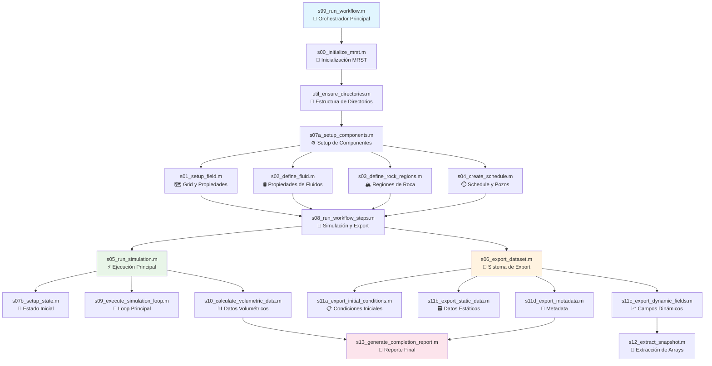

# Capítulo 4: Simulación de Yacimientos MRST

## 4.1 Introducción

Este capítulo documenta el workflow completo de simulación geomecánica usando MRST (MATLAB Reservoir Simulation Toolbox). El sistema actual ejecuta simulaciones 3D de flujo con efectos de compactación, generando datasets estructurados para análisis y machine learning.

### **Objetivos del Capítulo**
- ✅ Ejecutar el workflow completo de simulación MRST
- ✅ Entender cada script del sistema modular
- ✅ Configurar simulaciones 3D con 10 capas geológicas
- ✅ Generar datasets exportados con estructura optimizada
- ✅ Validar resultados de simulación geomecánica

## 4.2 Arquitectura del Sistema MRST

El sistema de simulación está implementado como un conjunto de scripts modulares que ejecutan un workflow completo desde la inicialización hasta la exportación de datos.

### **Workflow Principal Actualizado**



## 4.3 Scripts del Sistema Actual

### **Script Principal: s99_run_workflow.m**

**Propósito**: Orchestrador completo del workflow de simulación geomecánica MRST
**Funciones principales**:
- Inicialización completa del entorno MRST
- Coordinación de todos los módulos del sistema
- Generación de estructura de directorios optimizada
- Ejecución del workflow completo
- Validación y reporte final

**Workflow ejecutado**:
1. Inicialización MRST y semilla aleatoria reproducible
2. Creación de estructura de directorios
3. Setup de componentes (grid, fluidos, roca, pozos)
4. Ejecución de simulación y exportación
5. Validación de resultados y reporte de finalización

### **Módulos de Inicialización**

#### `s00_initialize_mrst.m` - Inicialización MRST
**Propósito**: Configurar el entorno MRST para Octave
**Características**:
- Usa la función `load_mrst()` del directorio padre
- Agrega paths críticos de MRST (core, utils, solvers)
- Verifica disponibilidad de funciones clave
- Funciones verificadas: `cartGrid`, `makeRock`, `initSimpleFluid`, `addWell`, `simpleSchedule`

#### `util_ensure_directories.m` - Estructura de Directorios
**Propósito**: Crear estructura optimizada de directorios de datos
**Directorios creados**:
- `data/initial/` - Condiciones iniciales
- `data/static/` - Datos estáticos del reservorio
- `data/dynamic/fields/` - Campos dinámicos temporales
- `data/dynamic/wells/` - Datos de pozos
- `data/temporal/` - Datos temporales
- `data/metadata/` - Información del dataset

### **Módulos de Setup de Componentes**

#### `s01_setup_field.m` - Grid y Propiedades de Roca
**Propósito**: Crear grid 3D y asignar propiedades geológicas por capas
**Configuración actual**:
- **Grid**: 20×20×10 celdas (4000 celdas totales)
- **Dimensiones**: Variable por capa según configuración YAML
- **Capas geológicas**: 10 capas con diferentes litologías
- **Propiedades**: Asignadas por layer_id desde configuración

**Características del grid 3D**:
```octave
% Creación de grid con capas variables
G = cartGrid([nx, ny, nz], [nx*dx, ny*dy, sum(dz_layers)]);
G = computeGeometry(G);
```

#### `s02_define_fluid.m` - Propiedades de Fluidos
**Propósito**: Sistema bifásico oil-water con curvas de permeabilidad relativa realistas
**Propiedades implementadas**:
- **Oil**: Viscosidad y densidad desde configuración YAML
- **Water**: Propiedades de salmuera
- **Curvas kr**: Tipo Corey con suavizado para estabilidad numérica
- **Endpoints**: Swcon y Sores configurables

**Exportación**: Propiedades guardadas en `../data/static/fluid_properties.mat`

#### `s03_define_rock_regions.m` - Clasificación Geomecánica
**Propósito**: Asignar regiones de roca para propiedades geomecánicas
**Sistema de clasificación**:
1. **Región 1 (Tight)**: φ < 0.18 - c_φ = 1e-5/psi, n = 8
2. **Región 2 (Medium)**: 0.18 ≤ φ < 0.22 - c_φ = 3e-5/psi, n = 6  
3. **Región 3 (Loose)**: φ ≥ 0.22 - c_φ = 5e-5/psi, n = 4

**Parámetros geomecánicos**:
- **c_φ**: Coeficiente de compactación [1/psi]
- **n**: Exponente permeabilidad-porosidad para acoplamiento
- **k0**: Permeabilidad inicial almacenada para cálculos

#### `s04_create_schedule.m` - Schedule y Pozos
**Propósito**: Configurar pozos y programa temporal de simulación
**Configuración de pozos**:
- **Productor**: Control BHP desde configuración
- **Inyector**: Control de tasa de inyección
- **Timesteps**: Secuencia adaptativa con multiplicador 1.1
- **Duración**: 3650 días (10 años) en 500 timesteps

### **Módulos de Ejecución**

#### `s05_run_simulation.m` - Orchestrador de Simulación
**Propósito**: Coordinar setup de estado inicial y ejecución de simulación
**Proceso**:
1. Setup de estado inicial via `s07b_setup_state()`
2. Ejecución del loop principal via `s09_execute_simulation_loop()`
3. Cálculo de datos volumétricos via `s10_calculate_volumetric_data()`
4. Estadísticas de simulación y timing

#### `s07b_setup_state.m` - Estado Inicial Hidrostático
**Propósito**: Inicializar presión y saturación con equilibrio hidrostático
**Implementación**:
- **Presión hidrostática**: P = P_datum + gradiente × (profundidad - datum_depth)
- **Contactos de fluidos**: Gas-oil-water según configuración
- **Presión capilar**: Zonas de transición en contactos
- **Saturaciones iniciales**: Por zona (gas, oil, water)

#### `s09_execute_simulation_loop.m` - Loop Principal Simplificado
**Propósito**: Simulación de flujo incompresible con efectos de compactación
**Algoritmo implementado**:
- Aplicación de efectos de pozos (BHP/tasa)
- **Compactación**: φ = φ₀ × (1 - c_φ × Δp)
- Actualización dinámica de propiedades de roca
- Generación de soluciones de pozos para cada timestep
- Reporte de progreso cada 10 pasos

#### `s10_calculate_volumetric_data.m` - Datos Volumétricos y Flujo
**Propósito**: Calcular métricas de producción y velocidades de flujo
**Cálculos**:
- **Producción acumulada**: Oil y water por pozo
- **Inyección acumulada**: Water y totales
- **Factor de recuperación**: Basado en OOIP estimado
- **Velocidades de flujo**: Ley de Darcy simplificada
- **Exportación**: `cumulative_data.mat` y `flow_data.mat`

### **Sistema de Exportación Modular**

#### `s06_export_dataset.m` - Sistema de Export Optimizado
**Propósito**: Orchestrar exportación completa con estructura organizada
**Módulos de exportación**:
- `s11a`: Condiciones iniciales
- `s11b`: Datos estáticos  
- `s11c`: Campos dinámicos 4D
- `s11d`: Metadata comprehensiva

#### `s12_extract_snapshot.m` - Extracción Unificada 2D/3D
**Propósito**: Procesar estados MRST en arrays estandarizados
**Arrays extraídos**:
- `effective_stress` - Esfuerzo efectivo [psi]
- `porosity` - Porosidad actual [-]
- `permeability` - Permeabilidad actual [mD]
- `rock_id` - Región geomecánica [-]
- `pressure` - Presión de poro [psi]
- `saturation` - Saturación de water [-]

**Formato de salida**: Reshape de MRST column-major a [nz,ny,nx] para Python

#### `s13_generate_completion_report.m` - Reporte Final
**Propósito**: Validar workflow completo y generar reporte de finalización
**Validaciones**:
- Existencia de todos los archivos de salida
- Métricas de timing del workflow
- Breakdown de rendimiento por módulo
- Instrucciones para siguientes pasos

## 4.4 Configuración Actualizada (reservoir_config.yaml)

### **Estructura 3D Actual**

La configuración actual soporta simulación 3D con 10 capas geológicas:

```yaml
# Grid 3D con capas variables
grid:
  nx: 20                      # Celdas en X
  ny: 20                      # Celdas en Y  
  nz: 10                      # Número de capas
  dx: 164.0                   # Tamaño de celda X [ft]
  dy: 164.0                   # Tamaño de celda Y [ft]
  dz: [50.0, 40.0, 35.0, 30.0, 25.0, 20.0, 15.0, 10.0, 8.0, 5.0]  # Espesor variable por capa [ft]

# Capas geológicas (10 capas de tope a base)
rock:
  layers:
    - id: 1
      name: "Shale Cap"
      depth_range: [7900, 7950]
      thickness: 50.0
      lithology: "shale"
      porosity: 0.08
      permeability: 0.1
      compressibility: 1.0e-6
      
    - id: 2  
      name: "Reservoir Sand 1"
      depth_range: [7950, 7990]
      thickness: 40.0
      lithology: "sandstone"
      porosity: 0.25
      permeability: 200.0
      compressibility: 3.1e-6
      
    # ... [8 capas adicionales con propiedades específicas]

# Condiciones iniciales con equilibrio hidrostático
initial_conditions:
  datum_depth: 8000.0         # Profundidad de referencia [ft]
  datum_pressure: 2900.0      # Presión en datum [psi]
  pressure_gradient: 0.433    # Gradiente de presión [psi/ft]
  oil_water_contact: 8150.0   # Contacto oil-water [ft]
  gas_oil_contact: 7950.0     # Contacto gas-oil [ft]

# Simulación extendida
simulation:
  total_time: 3650.0          # 10 años [days]
  num_timesteps: 500          # 500 timesteps
  timestep_type: "linear"
  timestep_multiplier: 1.1
```

### **Parámetros Clave Actualizados**

#### **Grid 3D**:
- **Dimensiones**: 20×20×10 = 4000 celdas
- **Espesor variable**: Cada capa tiene espesor específico
- **Profundidad total**: 238 ft (suma de espesores)

#### **Capas Geológicas**:
- **10 capas** con litologías específicas (shale, sandstone, limestone, granite)
- **Propiedades por capa**: Porosidad, permeabilidad, compresibilidad
- **Rangos realistas**: Desde shale cap (φ=0.08) hasta aquifer sand (φ=0.28)

#### **Condiciones Hidrostáticas**:
- **Presión variable**: P(z) = P_datum + 0.433 × (z - 8000)
- **Contactos de fluidos**: Gas, oil, y water zones
- **Zonas de transición**: Con presión capilar

## 4.5 Estructura de Datos de Salida Actualizada

### **Estructura de Directorios Optimizada**

```
data/
├── initial/
│   └── initial_conditions.mat    # Condiciones iniciales 3D [nz,ny,nx]
├── static/
│   ├── static_data.mat           # Grid, regiones, pozos
│   └── fluid_properties.mat      # Propiedades de fluidos
├── dynamic/
│   ├── fields/
│   │   ├── field_arrays.mat      # Arrays 4D [time,nz,ny,nx]
│   │   └── flow_data.mat         # Velocidades y flujo
│   └── wells/
│       ├── well_data.mat         # Tasas y BHP vs tiempo
│       └── cumulative_data.mat   # Producción acumulada
├── temporal/
│   └── time_data.mat            # Vectores de tiempo
└── metadata/
    ├── metadata.mat             # Metadata binaria
    └── metadata.yaml            # Metadata legible
```

### **Arrays 4D de Campos Dinámicos**

El archivo `field_arrays.mat` contiene arrays 4D con formato [tiempo, z, y, x]:

```matlab
% Dimensiones: [500, 10, 20, 20]
data.pressure           % Presión de poro [psi]
data.saturation        % Saturación de water [-]
data.porosity          % Porosidad efectiva [-]
data.permeability      % Permeabilidad efectiva [mD]
data.effective_stress  % Esfuerzo efectivo [psi]
data.rock_id          % Región geomecánica [-]
```

### **Metadata Comprehensiva**

```yaml
dataset_info:
  name: "MRST 3D Geomechanical Simulation"
  description: "10-layer 3D flow-compaction simulation with geomechanical coupling"
  version: "3.0"
  
grid:
  dimensions: [20, 20, 10]
  total_cells: 4000
  cell_sizes: [164.0, 164.0, "variable"]
  layer_thicknesses: [50.0, 40.0, 35.0, 30.0, 25.0, 20.0, 15.0, 10.0, 8.0, 5.0]
  
simulation:
  total_time_days: 3650.0
  n_timesteps: 500
  timestep_type: "adaptive"
  
geology:
  n_layers: 10
  lithologies: ["shale", "sandstone", "limestone", "granite"]
  depth_range: [7900, 8138]
  
wells:
  n_wells: 2
  types: ["producer", "injector"]
  controls: ["BHP", "rate"]
  
export_format:
  array_order: "[time, z, y, x]"
  units: "field_units"
  coordinate_system: "right_handed"
```

## 4.6 Ejecución del Workflow

### **Comando Principal**

Para ejecutar la simulación completa:

```bash
cd /workspaces/simulation/mrst_simulation_scripts
octave --eval "s99_run_workflow"
```

### **Secuencia de Ejecución**

El workflow ejecuta automáticamente:

1. **Inicialización**: `s00_initialize_mrst.m`
   - ✅ Carga MRST y verifica funciones
   - ✅ Configura paths necesarios

2. **Setup de Directorios**: `util_ensure_directories.m`
   - ✅ Crea estructura optimizada de datos
   - ✅ Verifica permisos de escritura

3. **Setup de Componentes**: `s07a_setup_components.m`
   - ✅ Grid 3D con 10 capas geológicas
   - ✅ Propiedades de fluidos oil-water
   - ✅ Clasificación geomecánica en 3 regiones
   - ✅ Schedule con 500 timesteps

4. **Simulación**: `s05_run_simulation.m`
   - ✅ Estado inicial hidrostático
   - ✅ Loop de simulación con compactación
   - ✅ Cálculo de datos volumétricos

5. **Exportación**: `s06_export_dataset.m`
   - ✅ Arrays 4D [tiempo,z,y,x]
   - ✅ Datos de pozos y volumétricos
   - ✅ Metadata completa

6. **Reporte Final**: `s13_generate_completion_report.m`
   - ✅ Validación de archivos generados
   - ✅ Estadísticas de rendimiento

## 4.7 Validación y Troubleshooting

### **Issue Crítico Identificado**

⚠️ **FUNCIÓN FALTANTE**: `util_read_config()` 

Los scripts referencian esta función pero no está implementada. Los scripts que la requieren:
- `s01_setup_field.m`
- `s02_define_fluid.m` 
- `s04_create_schedule.m`
- `s07b_setup_state.m`

### **Checks Automáticos del Sistema**

1. **Inicialización MRST**: Verificación de funciones MRST clave
2. **Estructura de Datos**: Validación de directorios y permisos
3. **Configuración**: Validación de parámetros YAML *(requiere util_read_config)*
4. **Simulación**: Progreso reportado cada 10 timesteps
5. **Export**: Validación de archivos generados

### **Métricas de Validación**

#### **Propiedades Físicas**:
- **Porosidad**: 0.02 ≤ φ ≤ 0.35
- **Permeabilidad**: 0.001 ≤ k ≤ 500 mD
- **Presión**: Gradiente hidrostático realista
- **Saturación**: 0 ≤ Sw ≤ 1

#### **Geomecánica**:
- **Compactación**: Δφ/φ₀ < 10%
- **Esfuerzo efectivo**: σ_eff > 0
- **Acoplamiento k-φ**: Exponentes n = [4,6,8]

#### **Balance Volumétrico**:
- **Conservación**: Entrada = Salida + Acumulación
- **Voidage ratio**: Cercano a 1.0 para waterflooding
- **Factor de recuperación**: Dentro de rangos típicos

### **Resolución de Problemas**

#### **1. MRST no inicializa**
```bash
# Verificar MRST path
ls -la /opt/mrst/
# Verificar load_mrst.m
octave --eval "load_mrst; cartGrid([2 2 1], [1 1 1])"
```

#### **2. Configuración YAML no se lee**
```octave
% Implementar función temporal
function config = util_read_config(yaml_file)
    % TODO: Implementar parser YAML o usar valores por defecto
    error('util_read_config no implementada');
end
```

#### **3. Simulación falla**
- Verificar dimensiones de grid
- Revisar propiedades iniciales de roca
- Confirmar configuración de pozos

#### **4. Export incompleto**
- Verificar estados de simulación generados
- Confirmar permisos de escritura en `data/`
- Revisar logs de s12_extract_snapshot

## 4.8 Próximos Pasos

### **Estado Actual del Sistema**

✅ **Implementado y Funcional**:
- Workflow modular completo
- Sistema de exportación optimizado 
- Simulación 3D con 10 capas geológicas
- Acoplamiento geomecánico simplificado

⚠️ **Pendientes de Implementación**:
- Función `util_read_config()` para lectura YAML
- Validación de configuración completa
- Testing automatizado del workflow

### **Siguientes Pasos Recomendados**

1. **Implementar `util_read_config()`**: Función crítica para lectura YAML
2. **Testing Completo**: Ejecutar workflow con datos de prueba
3. **Optimización**: Mejorar rendimiento para grids más grandes
4. **Documentación**: Actualizar capítulos siguientes

### **Archivos Generados tras Ejecución Exitosa**

```
data/
├── initial/initial_conditions.mat      # 4000 celdas [10×20×20]
├── static/static_data.mat              # Grid y pozos
├── dynamic/fields/field_arrays.mat     # [500×10×20×20] arrays
├── dynamic/wells/well_data.mat         # Series temporales
├── temporal/time_data.mat              # Vectores de tiempo
└── metadata/metadata.yaml             # Documentación completa
```

**Tamaño estimado del dataset**: ~400 MB para simulación completa

---

*[⬅️ Capítulo 3: Configuración de Parámetros](03_configuracion_parametros.md) | [Siguiente: Extracción de Datos ➡️](05_extraccion_datos.md)*

**Referencias de Código**: 
- `mrst_simulation_scripts/` - Scripts de simulación MRST
- `config/reservoir_config.yaml` - Configuración actualizada 3D
- `load_mrst.m` - Función de inicialización MRST 