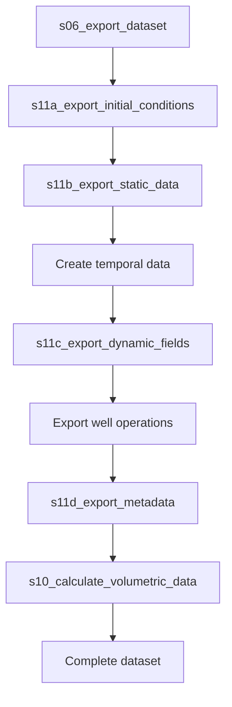

# MRST Simulator Data Generation

The MRST geomechanical simulator generates structured datasets for machine learning training by executing reservoir simulations and exporting optimized data arrays.

## Workflow Description

The simulator follows a sequential data generation workflow:



1. **Initial Conditions Export** - Creates baseline reservoir state at t=0
2. **Static Data Export** - Saves time-invariant grid and rock properties
3. **Temporal Data Creation** - Generates time vectors and control schedules
4. **Dynamic Fields Export** - Creates 3D field arrays for pressure, saturation, porosity, permeability, and effective stress
5. **Well Operations Export** - Saves well rates, pressures, and operational data
6. **Metadata Export** - Documents dataset structure, units, and conventions
7. **Volumetric Data Calculation** - Computes cumulative production, recovery factors, and flow velocities

## Data Structure

The simulator creates an organized directory structure under `../data/`:

```
../data/
├── initial/                    # Initial reservoir conditions (t=0)
│   └── initial_conditions.mat
├── static/                     # Time-invariant properties
│   ├── static_data.mat
│   └── fluid_properties.mat
├── dynamic/                    # Time-dependent arrays
│   ├── fields/                 # 3D field data [time, y, x]
│   │   ├── field_arrays.mat
│   │   └── flow_data.mat
│   └── wells/                  # Well operational data
│       ├── well_data.mat
│       └── cumulative_data.mat
├── temporal/                   # Time vectors and schedules
│   ├── time_data.mat
│   └── schedule.mat
└── metadata/                   # Dataset documentation
    ├── metadata.mat
    └── metadata.yaml
```

## Data Files and Variables

### Initial Conditions (`initial/initial_conditions.mat`)
- **pressure**: Initial pressure field [20×20] in psi
- **sw**: Initial water saturation field [20×20] dimensionless
- **phi**: Initial porosity field [20×20] dimensionless
- **k**: Initial permeability field [20×20] in mD

### Static Data (`static/static_data.mat`)
- **rock_id**: Rock region identifiers [20×20] dimensionless
- **grid_x**: Grid x-coordinates [21×1] in meters
- **grid_y**: Grid y-coordinates [21×1] in meters
- **cell_centers_x**: Cell center x-coordinates [20×1] in meters
- **cell_centers_y**: Cell center y-coordinates [20×1] in meters
- **wells**: Well location structure containing names, coordinates, and types

### Dynamic Fields (`dynamic/fields/field_arrays.mat`)
3D arrays with dimensions [n_timesteps, 20, 20]:
- **pressure**: Pressure evolution in psi
- **sw**: Water saturation evolution dimensionless
- **phi**: Porosity evolution dimensionless
- **k**: Permeability evolution in mD
- **sigma_eff**: Effective stress evolution in psi

### Flow Data (`dynamic/fields/flow_data.mat`)
- **time_days**: Time vector [n_timesteps×1] in days
- **vx**: Velocity in x-direction [n_timesteps, 20, 20]
- **vy**: Velocity in y-direction [n_timesteps, 20, 20]
- **velocity_magnitude**: Flow velocity magnitude [n_timesteps, 20, 20]

### Well Operations (`dynamic/wells/well_data.mat`)
- **time_days**: Time vector [n_timesteps×1] in days
- **well_names**: Well identifiers [n_wells×1]
- **qWs**: Water rates [n_timesteps×n_wells] in m³/day
- **qOs**: Oil rates [n_timesteps×n_wells] in m³/day
- **bhp**: Bottom hole pressure [n_timesteps×n_wells] in psi

### Cumulative Data (`dynamic/wells/cumulative_data.mat`)
- **time_days**: Time vector [n_timesteps×1] in days
- **well_names**: Well identifiers {'PROD1', 'INJ1'}
- **cum_oil_prod**: Cumulative oil production [n_timesteps×n_wells] in m³
- **cum_water_prod**: Cumulative water production [n_timesteps×n_wells] in m³
- **cum_water_inj**: Cumulative water injection [n_timesteps×n_wells] in m³
- **pv_injected**: Pore volumes injected [n_timesteps×1] in bbl
- **recovery_factor**: Recovery factor [n_timesteps×1] dimensionless

### Temporal Data (`temporal/time_data.mat`)
- **time_days**: Simulation time [n_timesteps×1] in days
- **dt_days**: Timestep sizes [n_timesteps×1] in days
- **control_indices**: Control period indices [n_timesteps×1]

### Metadata (`metadata/metadata.mat`)
- **dataset_info**: Dataset name, description, creation date, version
- **simulation**: Total time, timesteps, wells, grid dimensions
- **structure**: Folder and variable descriptions
- **optimization**: File sizes and optimization details
- **units**: Unit specifications for all variables
- **conventions**: Array ordering and coordinate systems
- **reservoir_data**: OOIP, pore volume, voidage ratio

## Mathematical Calculations

### Geomechanical Calculations
The simulator performs geomechanical calculations using `s12_extract_snapshot.m`:

```latex
σ' = σ_{total} - p_{pore}
```

Where:
- **σ'**: Effective stress (psi)
- **σ_{total}**: Total stress from lithostatic gradient (psi)
- **p_{pore}**: Pore pressure (psi)

### Porosity Updates
Pressure-dependent porosity changes:

```latex
φ = φ_0 (1 + c_φ Δσ')
```

Where:
- **φ**: Current porosity
- **φ_0**: Initial porosity
- **c_φ**: Rock compressibility
- **Δσ'**: Effective stress change from reference

### Permeability Updates
Kozeny-Carman relationship:

```latex
k = k_0 (φ/φ_0)^n
```

Where:
- **k**: Current permeability (mD)
- **k_0**: Initial permeability (mD)
- **n**: Porosity-permeability exponent

## Technical Specifications

### Grid Configuration
- **Grid Size**: Fixed 20×20 cells
- **Cell Dimensions**: 164.0 × 164.0 × 33.0 feet
- **Coordinate System**: Origin at (0,0), Y increases upward
- **Array Ordering**: [time, y, x] for Python compatibility

### Unit Conversions
- **Pressure**: Pa → psi (÷ 6894.76)
- **Permeability**: m² → mD (÷ 9.869233e-16)
- **Time**: seconds → days (÷ 86400)

### Physical Constraints
- **Minimum effective stress**: 100 psi
- **Porosity bounds**: 0.01 to 0.5
- **Permeability bounds**: Physical limits based on rock type

### Data Optimization
- **File Format**: MATLAB v7 format for cross-platform compatibility
- **Total Size**: ~30KB per simulation
- **Largest File**: field_arrays.mat (9.8KB)
- **Optimization**: Deduplication of static data, efficient 3D array storage

## Code Reference

**Source**: `mrst_simulation_scripts/s06_export_dataset.m`
**Dependencies**: `s11a_export_initial_conditions.m`, `s11b_export_static_data.m`, `s11c_export_dynamic_fields.m`, `s11d_export_metadata.m`, `s10_calculate_volumetric_data.m`
**Configuration**: `util_read_config.m` loads parameters from `reservoir_config.yaml`
**Geomechanical Processing**: `s12_extract_snapshot.m` performs stress and porosity calculations