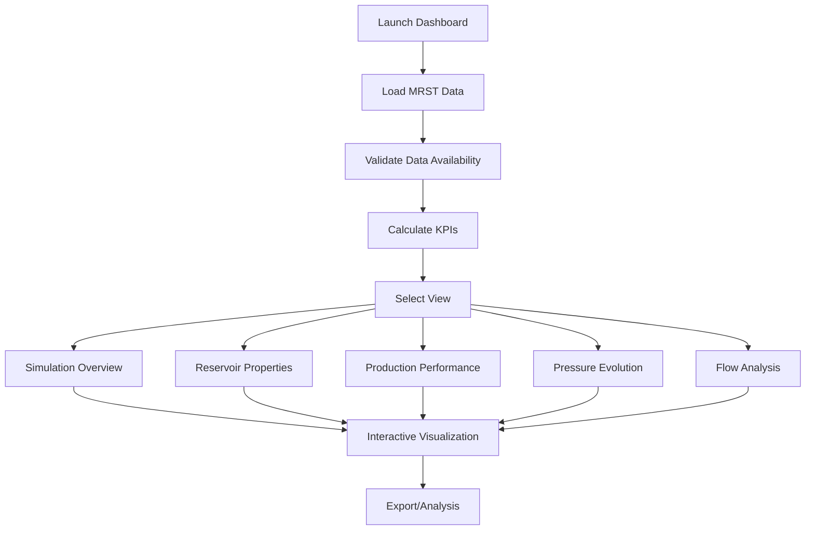

# MRST Simulation Dashboard Usage

## Title and Purpose

Interactive Streamlit dashboard for visualizing MRST geomechanical simulation results, providing product owner focused metrics and user-accessible information about reservoir performance.

## Workflow Description

The dashboard follows a structured workflow for visualization and analysis:

1. **Data Loading**: Loads MRST simulation data from standardized MAT file structure
2. **Data Validation**: Checks availability and integrity of simulation datasets
3. **Metrics Calculation**: Computes key performance indicators for product owner dashboard
4. **Interactive Visualization**: Creates user-accessible plots and charts
5. **Performance Analysis**: Provides reservoir engineering insights and recommendations



## Inputs and Outputs

### Input Data Structure

The dashboard expects MRST simulation data in the following structure:

```
data/
├── initial/
│   └── initial_conditions.mat    # pressure, sw, phi, k [20×20]
├── static/
│   └── static_data.mat           # rock_id, grid coordinates, wells
├── dynamic/
│   ├── fields/
│   │   ├── field_arrays.mat      # pressure, sw evolution [time,y,x]
│   │   └── flow_data.mat         # velocity components [time,y,x]
│   └── wells/
│       ├── well_data.mat         # qOs, qWs, bhp [time,well]
│       └── cumulative_data.mat   # cumulative production, recovery factor
└── metadata/
    └── metadata.mat              # simulation parameters, units
```

### Output Visualizations

1. **Simulation Overview**: Key metrics dashboard with grid size, simulation time, well count, recovery factor
2. **Reservoir Properties**: Porosity, permeability, and saturation distribution maps with statistics
3. **Production Performance**: Oil production rates, water injection rates, cumulative production, recovery factor
4. **Pressure Evolution**: Average pressure evolution and spatial pressure distribution snapshots
5. **Flow Analysis**: Velocity field visualization and flow magnitude evolution

## Mathematical Explanation

### Recovery Factor Calculation

The recovery factor is calculated using the fundamental reservoir engineering equation:

```latex
RF = \frac{N_p}{N} = \frac{\text{Cumulative Oil Production}}{\text{Original Oil in Place}}
```

Where:
- `RF` = Recovery Factor [-]
- `N_p` = Cumulative Oil Production [m³]
- `N` = Original Oil in Place [m³]

### Sweep Efficiency Calculation

Sweep efficiency is calculated from saturation data:

```latex
E_s = \frac{V_{swept}}{V_{total}} = \frac{\sum_{i,j} I(S_{w,final}(i,j) > S_{w,initial}(i,j) + 0.1)}{N_{cells}}
```

Where:
- `E_s` = Sweep Efficiency [-]
- `V_{swept}` = Swept Volume [m³]
- `V_{total}` = Total Reservoir Volume [m³]
- `I()` = Indicator function

### Production Decline Rate

Production decline rate is calculated using:

```latex
D = \frac{q_{peak} - q_{current}}{q_{peak} \cdot \Delta t}
```

Where:
- `D` = Decline Rate [1/day]
- `q_{peak}` = Peak Production Rate [m³/day]
- `q_{current}` = Current Production Rate [m³/day]
- `Δt` = Time Since Peak [days]

## Code Reference

**Source**: `dashboard/s99_run_dashboard.py`
**Supporting Modules**:
- `dashboard/util_data_loader.py` - MRST data loading with oct2py
- `dashboard/util_visualization.py` - Interactive Plotly visualizations
- `dashboard/util_metrics.py` - Performance metrics calculations

## Usage Instructions

### Prerequisites

The dashboard uses the existing conda environment with required dependencies:
- `streamlit` - Web dashboard framework
- `oct2py` - MRST MAT file reading
- `numpy` - Numerical computations
- `plotly` - Interactive visualizations

### Running the Dashboard

```bash
# Navigate to dashboard directory
cd dashboard

# Launch dashboard
python s99_run_dashboard.py

# Alternative: Direct streamlit launch
streamlit run s99_run_dashboard.py
```

The dashboard will open in your browser at `http://localhost:8501`

### Dashboard Navigation

1. **Sidebar Navigation**: Use the sidebar to select different analysis views
2. **Data Status**: Check data availability indicators in the sidebar
3. **Interactive Controls**: Use sliders and selectors to explore different time steps
4. **Hover Information**: Hover over plots for detailed data values
5. **Zoom and Pan**: Use mouse interactions to explore plot details

### View Descriptions

- **📊 Simulation Overview**: High-level KPIs and initial conditions
- **🏔️ Reservoir Properties**: Static reservoir characterization
- **🛢️ Production Performance**: Well performance and production analysis
- **📈 Pressure Evolution**: Pressure field analysis over time
- **🌊 Flow Analysis**: Velocity field and flow patterns

## Troubleshooting

### Common Issues

1. **Data Loading Errors**: Verify MAT file paths and structure
2. **oct2py Issues**: Ensure Octave is installed and accessible
3. **Performance Problems**: Check available memory for large datasets
4. **Visualization Errors**: Update plotly version if needed

### Error Messages

- `"Failed to load simulation data"`: Check data file availability
- `"oct2py not available"`: Install Octave and oct2py package
- `"Data file not found"`: Verify data directory structure

## Performance Metrics

The dashboard calculates the following product owner focused metrics:

### Key Performance Indicators (KPIs)
- Grid dimensions and simulation time
- Total well count and configuration
- Final recovery factor achievement

### Recovery Efficiency
- Overall recovery factor
- Sweep efficiency from saturation data
- Displacement efficiency calculations

### Production Performance
- Peak and current production rates
- Production decline analysis
- Water injection efficiency

### Pressure Performance
- Pressure maintenance ratio
- Pressure decline rate
- Spatial pressure distribution

### Flow Performance
- Velocity field analysis
- Flow uniformity assessment
- Flow pattern efficiency