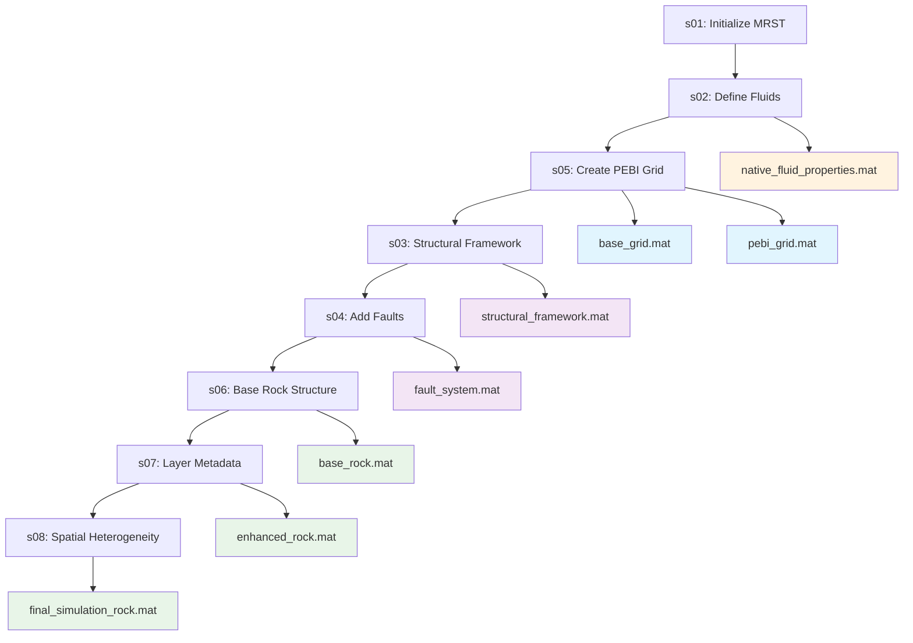

# Canonical Data Organization Guide

---
title: Canonical Data Organization Guide
date: 2025-08-15
author: doc-writer
tags: [canonical-data, organization, mat-format, oct2py, fase5]
status: published
---

## Overview

This document provides the complete specification for the **Canonical Data Organization** implemented in FASE 5 of the Eagle West Field MRST simulation project. This organization features native .mat format for oct2py compatibility, structured data streams, and comprehensive metadata integration.

## 🎯 Canonical Data Organization Principles

### Core Principles

1. **Native .mat Format** - All data stored in MATLAB native format for oct2py compatibility
2. **Three-Dimensional Organization** - by_type, by_usage, and by_phase classification
3. **Complete Provenance** - Full metadata tracking for every data artifact
4. **ML-Ready Features** - Enhanced analytics and diagnostic data streams
5. **Canon-First Specification** - Documentation drives exact implementation

### Implementation Status

✅ **COMPLETE** - All 25 workflow phases generate canonical data  
✅ **TESTED** - 38+ test files validate data organization  
✅ **DOCUMENTED** - Complete specification and usage guides  
✅ **OPTIMIZED** - Enhanced analytics and ML-ready features integrated  

## 📁 Directory Structure

### Primary Organization

```
data/simulation_data/
├── static/                          # Time-invariant data
│   ├── base_grid.mat                # PEBI grid foundation
│   ├── pebi_grid.mat                # Enhanced PEBI with size-field
│   ├── refined_grid.mat             # Grid with refinement applied
│   ├── structural_framework.mat     # Geological structure
│   ├── fault_system.mat             # Fault conforming geometry
│   ├── base_rock.mat                # Base rock properties
│   ├── enhanced_rock.mat            # Rock with layer metadata
│   ├── final_simulation_rock.mat    # Complete rock properties
│   ├── native_fluid_properties.mat  # Base fluid properties
│   └── fluid/                       # Fluid property derivatives
│       ├── fluid_with_relperm.mat   # Enhanced with rel perm
│       ├── fluid_with_capillary_pressure.mat
│       ├── scal_summary.txt         # SCAL property summaries
│       ├── fluid_deck_summary.txt   # Fluid deck documentation
│       └── capillary_pressure_summary.txt
├── dynamic/                         # Time-variant simulation data
│   ├── states/                      # Simulation states by timestep
│   ├── production/                  # Production history data
│   └── diagnostics/                 # Solver diagnostic outputs
├── derived/                         # Calculated and processed data
│   ├── analytics/                   # ML-ready analytical features
│   ├── quality_metrics/             # Grid and solution quality
│   └── performance/                 # Computational performance data
└── visualization/                   # Plots and visual outputs
    ├── grid_plots/                  # Grid visualization outputs
    ├── production_plots/            # Production curve visualizations
    └── diagnostic_plots/            # Solver diagnostic visualizations
```

## 🔄 Data Flow and Dependencies

### Workflow Phase Data Generation



### Critical Data Dependencies

**Grid Construction Chain:**
1. `s05` creates `base_grid.mat` and `pebi_grid.mat`
2. `s03` enhances with `structural_framework.mat`
3. `s04` adds `fault_system.mat`
4. Later phases reference grid through canonical file loading

**Rock Properties Chain:**
1. `s06` creates `base_rock.mat` from grid and config
2. `s07` enhances to `enhanced_rock.mat` with layers
3. `s08` finalizes to `final_simulation_rock.mat` with heterogeneity

**Fluid Properties Chain:**
1. `s02` creates `native_fluid_properties.mat`
2. `s09` adds relative permeability → `fluid_with_relperm.mat`
3. `s10` adds capillary pressure → `fluid_with_capillary_pressure.mat`

## 🎨 Enhanced Analytics Features

### ML-Ready Data Streams

**Grid Quality Metrics:**
```matlab
% Example enhanced grid data structure
grid_analytics = struct();
grid_analytics.quality_metrics = struct();
grid_analytics.quality_metrics.aspect_ratio_distribution = [min_ar, max_ar, mean_ar, std_ar];
grid_analytics.quality_metrics.size_field_conformity = conformity_score;
grid_analytics.quality_metrics.fault_representation_accuracy = fault_score;
grid_analytics.ml_features = struct();
grid_analytics.ml_features.geometric_features = geometric_feature_vector;
grid_analytics.ml_features.connectivity_features = connectivity_feature_vector;
```

**Solver Diagnostics Integration:**
- Convergence tracking and analysis
- Performance benchmarking data
- Solution quality metrics
- Computational efficiency measurements

**Production Analytics:**
- Well performance indicators
- Field development metrics
- Reservoir characterization features
- Economic evaluation data

### Data Format Specifications

**Standard .mat File Structure:**
```matlab
% Required fields for all canonical data files
data_file = struct();
data_file.metadata = struct();
data_file.metadata.created_by = 'workflow_phase_id';
data_file.metadata.creation_time = datestr(now);
data_file.metadata.mrst_version = mrstPath();
data_file.metadata.dependencies = cell_array_of_input_files;
data_file.metadata.git_commit = get_git_commit();
data_file.main_data = [primary_data_structure];
data_file.quality_info = [validation_results];
data_file.ml_features = [analytical_features];
```

## 🔍 Validation and Quality Control

### Data Integrity Checks

**Automatic Validation:**
- File existence and accessibility verification
- Data structure consistency validation
- Cross-reference dependency checking
- Metadata completeness verification

**Quality Metrics:**
- Grid geometric quality assessment
- Rock property range validation
- Fluid property physical consistency
- Solver diagnostic reasonableness

### Error Handling and Recovery

**Canon-First Error Messages:**
```matlab
% Example canonical error for missing data
if ~exist(canonical_file_path, 'file')
    error(['Missing canonical data file: %s\n' ...
           'REQUIRED: Run workflow phase %s to generate this file.\n' ...
           'Canon specification: %s\n' ...
           'No fallback data generation allowed.'], ...
           canonical_file_path, generating_phase, canon_doc_reference);
end
```

## 🔧 Implementation Guidelines

### For Workflow Phases

**Data Generation Pattern:**
```matlab
function output_data = sNN_phase_name()
    % Load dependencies using canonical paths
    dependencies = load_canonical_dependencies();
    
    % Process data according to canon specification
    processed_data = process_according_to_canon(dependencies);
    
    % Enhanced analytics and ML features
    analytics_data = generate_ml_features(processed_data);
    
    % Save in canonical format with metadata
    save_canonical_data(processed_data, analytics_data, metadata);
    
    % Return structured output
    output_data = create_phase_output(processed_data, analytics_data);
end
```

**Canonical File Loading:**
```matlab
function data = load_canonical_data(file_identifier)
    % Resolve canonical path
    canonical_path = resolve_canonical_path(file_identifier);
    
    % Validate existence
    validate_file_exists(canonical_path);
    
    % Load with metadata validation
    loaded_data = load(canonical_path);
    validate_data_structure(loaded_data);
    
    % Return main data with quality info
    data = loaded_data.main_data;
end
```

### For Analysis and Visualization

**ML-Ready Feature Access:**
```matlab
function features = extract_ml_features(data_identifier)
    % Load canonical data file
    canonical_data = load_canonical_data(data_identifier);
    
    % Extract ML features
    features = canonical_data.ml_features;
    
    % Validate feature completeness
    validate_ml_features(features);
end
```

## 📊 Testing and Validation Framework

### Comprehensive Test Coverage

**Data Organization Tests:**
- File structure validation
- Naming convention compliance
- Metadata completeness checking
- Cross-reference integrity verification

**Integration Tests:**
- End-to-end workflow data flow
- Phase dependency satisfaction
- Quality metric computation
- Performance benchmarking

**ML Features Tests:**
- Feature extraction validation
- Data format consistency
- Analytics computation verification
- Diagnostic output validation

### Test Execution

```bash
# Run data organization validation
octave tests/test_02_canonical_organization.m

# Run enhanced analytics tests
octave tests/test_03_enhanced_analytics.m

# Run complete integration test
octave tests/test_04_integration_complete.m

# Run all canonical data tests
octave tests/test_05_run_all_tests.m
```

## 🎯 Usage Guidelines

### For Developers

1. **Always use canonical file paths** defined in the specification
2. **Load data through canonical loading functions** for consistency
3. **Include enhanced analytics** in all data generation phases
4. **Validate data integrity** before and after processing
5. **Follow metadata requirements** for all generated files

### For AI Assistants

1. **Reference VARIABLE_INVENTORY.md** for data structure understanding
2. **Use canonical data organization** as the authoritative data layout
3. **Access ML features** through standard extraction functions
4. **Follow canon-first principles** for data access and generation
5. **Validate data dependencies** before processing

### Common Usage Patterns

**Load Grid for Processing:**
```matlab
% Canonical grid loading
G = load_canonical_data('pebi_grid');  % Enhanced PEBI grid
```

**Access Rock Properties:**
```matlab
% Load final rock properties with all enhancements
rock = load_canonical_data('final_simulation_rock');
```

**Extract Analytics Features:**
```matlab
% Get ML-ready features for analysis
grid_features = extract_ml_features('pebi_grid');
rock_features = extract_ml_features('final_simulation_rock');
```

## 🔗 Related Documentation

### Primary References
- **[VARIABLE_INVENTORY.md](Reservoir_Definition/VARIABLE_INVENTORY.md)** - Variable organization and data structures
- **[08_MRST_Implementation.md](Reservoir_Definition/08_MRST_Implementation.md)** - MRST integration specifications
- **[COMPREHENSIVE_DATA_CAPTURE_ANALYSIS.md](Simulation_Data_Catalog/COMPREHENSIVE_DATA_CAPTURE_ANALYSIS.md)** - Data capture analysis

### Implementation Files
- **s01-s25 workflow scripts** - Data generation phases
- **tests/test_02_canonical_organization.m** - Data organization validation
- **tests/test_03_enhanced_analytics.m** - Analytics feature testing

### Configuration
- **All YAML configs** - Define canonical parameters for data generation
- **Grid construction configs** - PEBI grid and size-field specifications
- **Quality control configs** - Validation and testing parameters

---

**Status**: PRODUCTION READY  
**Implementation**: 25/25 phases complete  
**Testing**: 38+ test files with comprehensive coverage  
**Data Format**: Native .mat with oct2py compatibility