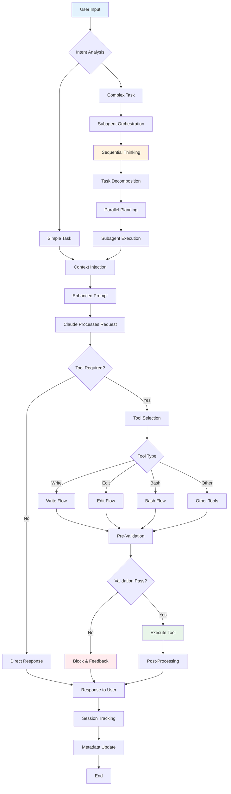

# Code Generation Flow - Step-by-Step Process

## Overview

Claude Code's generation flow represents a revolutionary approach to AI-assisted development, implementing a deterministic pipeline that prevents errors rather than correcting them. This document provides a detailed walkthrough of the complete generation process.

## High-Level Flow Diagram



## Detailed Phase Analysis

### Phase 1: Input Processing

#### Step 1.1: User Prompt Reception
```
Trigger: User submits request
Hook: UserPromptSubmit
Action: Display rules loaded message
```

#### Step 1.2: Intent Analysis
**Categories Detected**:
- Coding: Implementation requests
- Testing: Test creation/modification
- Debugging: Error investigation
- Documentation: Doc generation
- Architecture: Design decisions
- Data Generation: Dataset creation
- Configuration: Settings/setup
- Refactoring: Code improvement

**Pattern Matching**:
```regex
coding: /implement|create|build|develop|code/
testing: /test|unittest|pytest|coverage/
debugging: /debug|fix|error|issue|problem/
documentation: /document|docs|explain|describe/
```

#### Step 1.3: Context Injection
Based on detected intent, relevant context is injected:
- MCP prompts activation
- Relevant rule emphasis
- Template suggestions
- Historical patterns

### Phase 2: Task Complexity Assessment

#### Step 2.1: Complexity Evaluation
**Simple Task Indicators**:
- Single file operation
- Clear implementation path
- No cross-dependencies
- Standard patterns

**Complex Task Indicators**:
- Multiple file changes
- Architectural decisions
- Unknown dependencies
- Research required

#### Step 2.2: Orchestration Decision
```
IF complexity_score > threshold:
    ROUTE to subagent_orchestration
ELSE:
    CONTINUE to direct_processing
```

### Phase 3A: Complex Task Orchestration

#### Step 3A.1: Sequential Thinking Activation
**MCP Server**: `sequential-thinking`
**Process**:
1. Problem decomposition
2. Step identification
3. Dependency mapping
4. Parallel opportunity detection

#### Step 3A.2: Subagent Generation
**Workflow Types**:
```
implementation_workflow:
  - analysis_agent
  - design_agent  
  - implementation_agent
  - validation_agent

debugging_workflow:
  - investigation_agent
  - root_cause_agent
  - solution_agent
  - verification_agent
```

#### Step 3A.3: Parallel Execution
```python
agents = generate_subagents(task)
results = parallel_execute(agents)
context = merge_results(results)
```

### Phase 3B: Simple Task Processing

#### Step 3B.1: Direct Context Enhancement
- Load relevant templates
- Inject applicable rules
- Add project patterns
- Include recent context

### Phase 4: Code Generation

#### Step 4.1: Claude Processing
With enhanced context, Claude generates:
- Code implementation
- Explanatory text
- Tool invocations
- Follow-up actions

#### Step 4.2: Tool Selection
**Decision Tree**:
```
IF creating_new_file:
    SELECT Write
ELIF modifying_existing:
    SELECT Edit or MultiEdit
ELIF running_command:
    SELECT Bash
ELIF organizing_tasks:
    SELECT TodoWrite
ELSE:
    RETURN direct_response
```

### Phase 5: Pre-Validation Pipeline

#### Step 5.1: Parallel Validation Execution
**For Write/Edit Operations**:
```bash
parallel_validators=(
    "route-files.sh"
    "validate-code-style.sh"
    "validate-file-naming.sh"
    "validate-scope.sh"
)

# Execute all validators simultaneously
for validator in "${parallel_validators[@]}"; do
    "$validator" "$@" &
done
wait
```

#### Step 5.2: Validation Checks

**File Routing Validation**:
- Pattern matching (filename)
- Content analysis
- Confidence scoring
- Placement suggestion

**Code Style Validation**:
- Function length check (<40 lines)
- Naming convention (snake_case)
- Comment format (English, step/substep)
- Import organization

**File Naming Validation**:
- Pattern compliance
- Character restrictions
- Prefix requirements
- Extension matching

**Scope Validation**:
- Boundary checking
- Edit scope limits
- Structural integrity
- Cross-file coordination

#### Step 5.3: Error Aggregation
```bash
total_errors=0
critical_errors=0

for result in "${validation_results[@]}"; do
    case $exit_code in
        0) continue ;;
        1) ((total_errors++)) ;;
        2) ((critical_errors++)) ;;
    esac
done

if [ $critical_errors -gt 0 ]; then
    BLOCK_OPERATION
fi
```

### Phase 6: Tool Execution

#### Step 6.1: Conditional Execution
```
IF all_validations_pass:
    EXECUTE tool_operation
ELSE:
    RETURN error_feedback
```

#### Step 6.2: Operation Types

**Write Operation**:
1. Create file at validated path
2. Write content
3. Set permissions
4. Update tracking

**Edit Operation**:
1. Read current file
2. Apply modifications
3. Preserve structure
4. Save changes

**MultiEdit Operation**:
1. Load file once
2. Apply edit sequence
3. Validate consistency
4. Atomic save

### Phase 7: Post-Processing

#### Step 7.1: Sequential Post-Validation
```
post_processors_sequence:
  1. validate-docstrings.sh
  2. cleanup-print-statements.sh
  3. auto-format.py
  4. update-metadata.py
```

#### Step 7.2: Documentation Validation
- Check for required docstrings
- Validate Google Style format
- Ensure English language
- Verify completeness

#### Step 7.3: Cleanup Operations
- Remove unauthorized prints
- Format code consistently
- Update import order
- Standardize spacing

### Phase 8: Response Generation

#### Step 8.1: Success Response
```
Components:
- Operation summary
- File path(s) affected
- Changes made
- Next steps (if any)
```

#### Step 8.2: Error Response
```
Components:
- Error description
- Specific violations
- How to fix
- Retry suggestions
```

### Phase 9: Session Management

#### Step 9.1: Metadata Tracking
```json
{
  "session_id": "uuid",
  "timestamp": "ISO-8601",
  "operations": [
    {
      "tool": "Write",
      "file": "path",
      "validations": {...},
      "result": "success|failure"
    }
  ],
  "rules_applied": [...],
  "context_injected": {...}
}
```

#### Step 9.2: Git Integration
- Auto-commit preparation
- Change tracking
- Blame annotation
- History preservation

## Special Flow Patterns

### Pattern 1: Test-Driven Development
```
1. User requests feature
2. System suggests test creation first
3. Routes test file to tests/
4. Creates implementation file in src/
5. Links test and implementation
```

### Pattern 2: Debug Investigation
```
1. User reports issue
2. Debug orchestration activated
3. Creates debug script in debug/
4. Investigates systematically
5. Proposes fix in src/
6. Updates tests if needed
```

### Pattern 3: Documentation Generation
```
1. User requests docs
2. Analyzes code structure
3. Generates structured markdown
4. Validates cross-references
5. Updates index files
```

### Pattern 4: Refactoring Flow
```
1. User requests improvement
2. Analyzes current structure
3. Plans minimal changes
4. Validates scope boundaries
5. Applies atomic updates
```

## Performance Optimizations

### Parallel Processing
- Validation hooks run concurrently
- Subagents execute in parallel
- Post-processing sequential but optimized

### Caching Strategy
- Template caching
- Rule compilation
- Pattern matching optimization
- Result memoization

### Early Termination
- Fail fast on critical errors
- Skip unnecessary validations
- Conditional post-processing

## Error Recovery

### Validation Failures
1. Collect all errors
2. Prioritize by severity
3. Provide actionable feedback
4. Suggest corrections
5. Offer retry options

### Tool Failures
1. Capture error details
2. Rollback if possible
3. Log for debugging
4. Provide alternatives
5. Maintain session state

### System Failures
1. Graceful degradation
2. Fallback to basic flow
3. Preserve user work
4. Enable manual recovery
5. Report to monitoring

## Integration Points

### MCP Servers
- **Memory**: Context persistence
- **Filesystem**: Enhanced operations
- **Sequential-Thinking**: Complex decomposition
- **Git**: Version control
- **Obsidian**: Documentation
- **Time**: Temporal operations

### External Tools
- Git hooks integration
- CI/CD pipeline triggers
- IDE notifications
- Monitoring systems

## Metrics and Monitoring

### Flow Metrics
- Intent detection accuracy
- Validation pass rates
- Tool execution times
- Error frequencies
- User satisfaction

### Performance Metrics
- Validation latency
- Parallel efficiency
- Cache hit rates
- Resource usage

### Quality Metrics
- Rule compliance rates
- Code quality scores
- Documentation coverage
- Test coverage

## Best Practices

### For Users
1. Provide clear, specific requests
2. Include context when relevant
3. Follow suggested patterns
4. Review validation feedback

### For Developers
1. Keep validations fast
2. Provide clear error messages
3. Maintain backward compatibility
4. Document edge cases

### For Administrators
1. Monitor performance metrics
2. Update rules gradually
3. Track user feedback
4. Optimize bottlenecks

## Conclusion

Claude Code's generation flow implements a sophisticated, multi-phase process that ensures code quality through prevention rather than correction. By combining intelligent intent analysis, parallel validation, and deterministic enforcement, it delivers consistent, high-quality code generation while maintaining excellent performance and user experience. The system's modular design allows for continuous improvement and adaptation to evolving project needs.