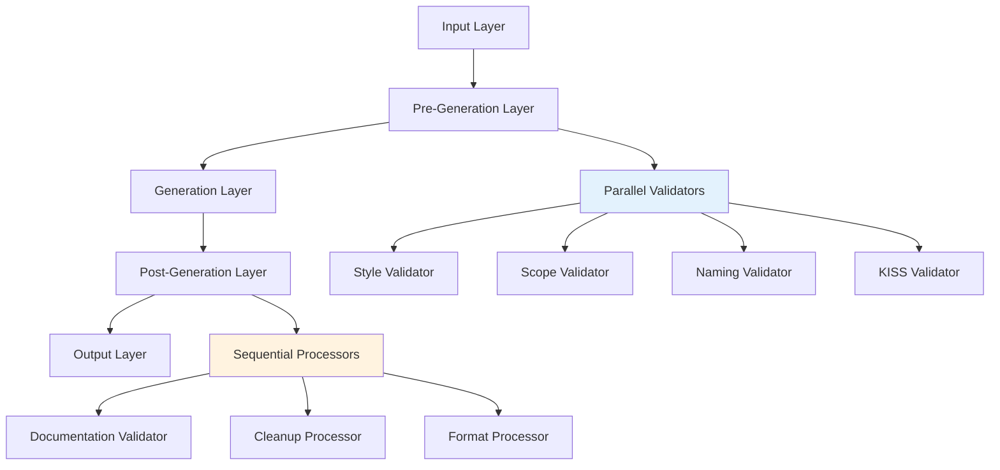

# Validation Pipeline - Multi-Layer System

## Overview

Claude Code's validation pipeline implements a sophisticated multi-layer system that validates code at different stages of generation, ensuring compliance through parallel execution, intelligent error aggregation, and deterministic blocking. This document details the complete validation architecture.

## Pipeline Architecture

### Layer Structure



## Validation Layers

### Layer 1: Input Validation

**Purpose**: Validate user input before processing
**Timing**: UserPromptSubmit hook
**Validators**:
- Intent classification
- Security scanning
- Context relevance

**Process**:
```python
def validate_input(user_prompt):
    # Security check
    if contains_malicious_patterns(user_prompt):
        return block_with_security_error()
    
    # Intent validation
    intent = classify_intent(user_prompt)
    if not intent.is_valid():
        return suggest_clarification()
    
    # Context check
    if not has_sufficient_context(user_prompt):
        return request_additional_info()
```

### Layer 2: Pre-Generation Validation

**Purpose**: Validate before code generation
**Timing**: PreToolUse hook
**Execution**: Parallel for performance

#### 2.1 Style Validation

**Validator**: `validate-code-style.sh`
**Checks**:
```bash
# Function length validation
MAX_LINES=40
function_lines=$(count_function_lines "$content")
if [ $function_lines -gt $MAX_LINES ]; then
    error "Function exceeds $MAX_LINES lines"
fi

# Naming convention
if ! matches_pattern "^[a-z_][a-z0-9_]*$" "$name"; then
    error "Invalid naming: must be snake_case"
fi

# Language validation
if contains_non_english_comments "$content"; then
    error "All comments must be in English"
fi

# Step/substep format
if ! has_proper_step_format "$content"; then
    error "Missing step/substep structure"
fi
```

#### 2.2 Scope Validation

**Validator**: `validate-scope.py`
**Checks**:
```python
def validate_scope(file_path, changes):
    # Boundary checking
    if changes_outside_target_scope(changes):
        return ValidationError("Changes exceed scope boundaries")
    
    # Structural integrity
    if breaks_existing_structure(changes):
        return ValidationError("Changes break code structure")
    
    # Multi-file coordination
    if requires_multi_file_changes(changes):
        if not has_clear_dependencies(changes):
            return ValidationError("Multi-file changes lack clear dependencies")
```

#### 2.3 Naming Validation

**Validator**: `validate-file-naming.sh`
**Patterns**:
```bash
# Script patterns
SCRIPT_PATTERN="^s[0-9]{2}[a-z]?_[a-z_]+\.(py|m)$"
TEST_PATTERN="^test_[0-9]{2}_[a-z_]+\.(py|m)$"
DEBUG_PATTERN="^dbg_[a-z_]+\.(py|m)$"

# Validation logic
case "$filename" in
    test_*) validate_pattern "$TEST_PATTERN" ;;
    dbg_*) validate_pattern "$DEBUG_PATTERN" ;;
    s[0-9]*) validate_pattern "$SCRIPT_PATTERN" ;;
    *) validate_generic_pattern ;;
esac
```

#### 2.4 KISS Validation

**Validator**: `validate-kiss.py`
**Checks**:
```python
def validate_kiss_principle(content):
    violations = []
    
    # Try/except usage
    try_except_uses = find_try_except_blocks(content)
    for use in try_except_uses:
        if not is_io_boundary(use):
            violations.append(f"Invalid try/except at line {use.line}")
    
    # Hard-coded values
    hardcoded = find_hardcoded_values(content)
    for value in hardcoded:
        if is_formula_constant(value):
            violations.append(f"Hard-coded constant at line {value.line}")
    
    # Complexity check
    complexity = calculate_cyclomatic_complexity(content)
    if complexity > MAX_COMPLEXITY:
        violations.append(f"Excessive complexity: {complexity}")
    
    return violations
```

### Layer 3: Generation Validation

**Purpose**: Real-time validation during generation
**Timing**: During tool execution
**Features**:
- Incremental validation
- Context preservation
- Rollback capability

**Process**:
```python
class GenerationValidator:
    def __init__(self):
        self.checkpoint = None
        self.violations = []
    
    def start_generation(self):
        self.checkpoint = create_checkpoint()
    
    def validate_increment(self, change):
        if not is_valid_increment(change):
            self.violations.append(change)
            return False
        return True
    
    def rollback_if_needed(self):
        if self.violations:
            restore_checkpoint(self.checkpoint)
            return self.violations
```

### Layer 4: Post-Generation Validation

**Purpose**: Final validation and cleanup
**Timing**: PostToolUse hook
**Execution**: Sequential for consistency

#### 4.1 Documentation Validation

**Validator**: `validate-docstrings.sh`
**Process**:
```python
def validate_documentation(file_path):
    ast_tree = parse_file(file_path)
    
    for node in ast_tree:
        if is_public_function(node):
            if not has_docstring(node):
                return error(f"Missing docstring: {node.name}")
            
            docstring = get_docstring(node)
            if not is_google_style(docstring):
                return error(f"Invalid format: {node.name}")
            
            if not is_english(docstring):
                return error(f"Non-English docs: {node.name}")
```

#### 4.2 Cleanup Processing

**Validator**: `cleanup-print-statements.sh`
**Actions**:
```bash
# Remove print statements
sed -i '/^\s*print(/d' "$file"

# Remove disp statements (Octave)
sed -i '/^\s*disp(/d' "$file"

# Comment out debug logging
sed -i 's/^\(.*logger\.debug.*\)$/# \1/' "$file"

# Remove temporary variables
sed -i '/^\s*temp_.*=/d' "$file"
```

#### 4.3 Format Processing

**Validator**: `auto-format.py`
**Standards**:
```python
def auto_format(file_path):
    content = read_file(file_path)
    
    # Import organization
    content = organize_imports(content)
    
    # Spacing standardization
    content = standardize_spacing(content)
    
    # Line length enforcement
    content = enforce_line_length(content, max_length=100)
    
    # Trailing whitespace
    content = remove_trailing_whitespace(content)
    
    write_file(file_path, content)
```

## Parallel Execution Strategy

### Parallel Validator Framework

```bash
#!/bin/bash
# Parallel execution framework

run_parallel_validators() {
    local file_path="$1"
    local content="$2"
    local pids=()
    local results=()
    
    # Launch validators in background
    validate-code-style.sh "$file_path" "$content" &
    pids+=($!)
    
    validate-naming.sh "$file_path" &
    pids+=($!)
    
    validate-scope.sh "$file_path" "$content" &
    pids+=($!)
    
    validate-kiss.sh "$content" &
    pids+=($!)
    
    # Wait and collect results
    for pid in "${pids[@]}"; do
        wait $pid
        results+=($?)
    done
    
    # Aggregate results
    return $(aggregate_results "${results[@]}")
}
```

### Performance Metrics

**Parallel Speedup**:
```
Sequential Time: ~2000ms
Parallel Time: ~600ms
Speedup Factor: 3.3x
```

**Resource Usage**:
```
CPU Cores: 4 (typical)
Memory: <50MB per validator
I/O: Minimal (memory-based)
```

## Error Aggregation System

### Error Classification

```python
class ValidationError:
    CRITICAL = 2  # Blocks operation
    WARNING = 1   # Non-blocking suggestion
    INFO = 0      # Informational only
    
    def __init__(self, level, message, location=None, fix=None):
        self.level = level
        self.message = message
        self.location = location
        self.suggested_fix = fix
```

### Aggregation Logic

```python
def aggregate_validation_results(results):
    errors = {
        'critical': [],
        'warnings': [],
        'info': []
    }
    
    for result in results:
        if result.level == ValidationError.CRITICAL:
            errors['critical'].append(result)
        elif result.level == ValidationError.WARNING:
            errors['warnings'].append(result)
        else:
            errors['info'].append(result)
    
    # Determine action
    if errors['critical']:
        return block_operation(errors)
    elif errors['warnings']:
        return show_warnings_and_continue(errors)
    else:
        return continue_operation()
```

### Error Reporting Format

```
❌ VALIDATION FAILED: 3 critical errors found

[1] Code Style Violation
    File: src/analyzer.py
    Line: 45-92
    Issue: Function exceeds 40 line limit (currently 47 lines)
    Fix: Split into helper functions:
         - extract_preprocessing() for lines 50-65
         - extract_validation() for lines 66-80

[2] Naming Convention Violation
    File: src/analyzer.py
    Line: 15
    Issue: Variable 'dataFrame' uses camelCase
    Fix: Rename to 'data_frame'

[3] KISS Principle Violation
    File: src/analyzer.py
    Line: 120
    Issue: try/except used for flow control
    Fix: Use explicit condition check instead
```

## Validation Rules Matrix

| Validator | Type | Layer | Execution | Blocking | Performance |
|-----------|------|-------|-----------|----------|-------------|
| Security | Input | 1 | Serial | Always | <10ms |
| Intent | Input | 1 | Serial | Sometimes | <50ms |
| Style | Code | 2 | Parallel | Configurable | ~200ms |
| Scope | Code | 2 | Parallel | Always | ~150ms |
| Naming | File | 2 | Parallel | Always | ~100ms |
| KISS | Code | 2 | Parallel | Always | ~300ms |
| Route | File | 2 | Parallel | Sometimes | ~150ms |
| Docstring | Doc | 4 | Serial | Configurable | ~200ms |
| Cleanup | Code | 4 | Serial | Never | ~100ms |
| Format | Code | 4 | Serial | Never | ~150ms |

## Conditional Validation

### Context-Aware Rules

```python
def get_applicable_validators(context):
    validators = ['base_validators']
    
    if context.file_type == 'python':
        validators.extend(['python_validators'])
    elif context.file_type == 'octave':
        validators.extend(['octave_validators'])
    
    if context.is_test_file:
        validators.extend(['test_validators'])
    elif context.is_debug_file:
        validators.extend(['debug_validators'])
    
    if context.project_area == 'ml':
        validators.extend(['ml_validators'])
    
    return validators
```

### Dynamic Threshold Adjustment

```python
class DynamicThresholds:
    def __init__(self):
        self.base_thresholds = {
            'function_length': 40,
            'complexity': 10,
            'line_length': 100
        }
    
    def adjust_for_context(self, context):
        thresholds = self.base_thresholds.copy()
        
        # Relax for test files
        if context.is_test_file:
            thresholds['function_length'] = 60
            
        # Strict for core modules
        if context.is_core_module:
            thresholds['complexity'] = 7
            
        return thresholds
```

## Validation Caching

### Cache Strategy

```python
class ValidationCache:
    def __init__(self):
        self.cache = {}
        self.ttl = 300  # 5 minutes
    
    def get_cached_result(self, file_hash, validator_name):
        key = f"{file_hash}:{validator_name}"
        if key in self.cache:
            result, timestamp = self.cache[key]
            if time.time() - timestamp < self.ttl:
                return result
        return None
    
    def cache_result(self, file_hash, validator_name, result):
        key = f"{file_hash}:{validator_name}"
        self.cache[key] = (result, time.time())
```

## Monitoring and Metrics

### Validation Metrics

```python
class ValidationMetrics:
    def __init__(self):
        self.metrics = {
            'total_validations': 0,
            'passed': 0,
            'failed': 0,
            'warnings': 0,
            'execution_times': [],
            'failure_reasons': {}
        }
    
    def record_validation(self, validator, result, duration):
        self.metrics['total_validations'] += 1
        self.metrics['execution_times'].append(duration)
        
        if result.is_success():
            self.metrics['passed'] += 1
        else:
            self.metrics['failed'] += 1
            self.track_failure_reason(validator, result.reason)
```

### Performance Tracking

```bash
# Log validation performance
echo "[$(date +%s)] $validator_name: ${duration}ms - $result" >> validation.log

# Alert on slow validators
if [ $duration -gt $THRESHOLD ]; then
    alert "Slow validator: $validator_name took ${duration}ms"
fi
```

## Best Practices

### Validator Development

1. **Fast Execution**: Target <300ms per validator
2. **Clear Messages**: Provide actionable error feedback
3. **Minimal Dependencies**: Reduce external requirements
4. **Stateless Design**: No side effects between runs

### Pipeline Configuration

1. **Parallel When Possible**: Maximize concurrent execution
2. **Sequential When Necessary**: Maintain order dependencies
3. **Cache Strategically**: Balance memory vs speed
4. **Monitor Continuously**: Track performance metrics

### Error Handling

1. **Fail Fast**: Exit on first critical error
2. **Batch Warnings**: Group related issues
3. **Provide Fixes**: Suggest specific solutions
4. **Context Preservation**: Include relevant information

## Conclusion

Claude Code's validation pipeline represents a sophisticated multi-layer system that ensures code quality through parallel execution, intelligent error aggregation, and context-aware validation. By validating at multiple stages and providing clear, actionable feedback, it prevents errors before they occur while maintaining excellent performance. The system's modular design allows for easy extension and customization to meet evolving project needs.