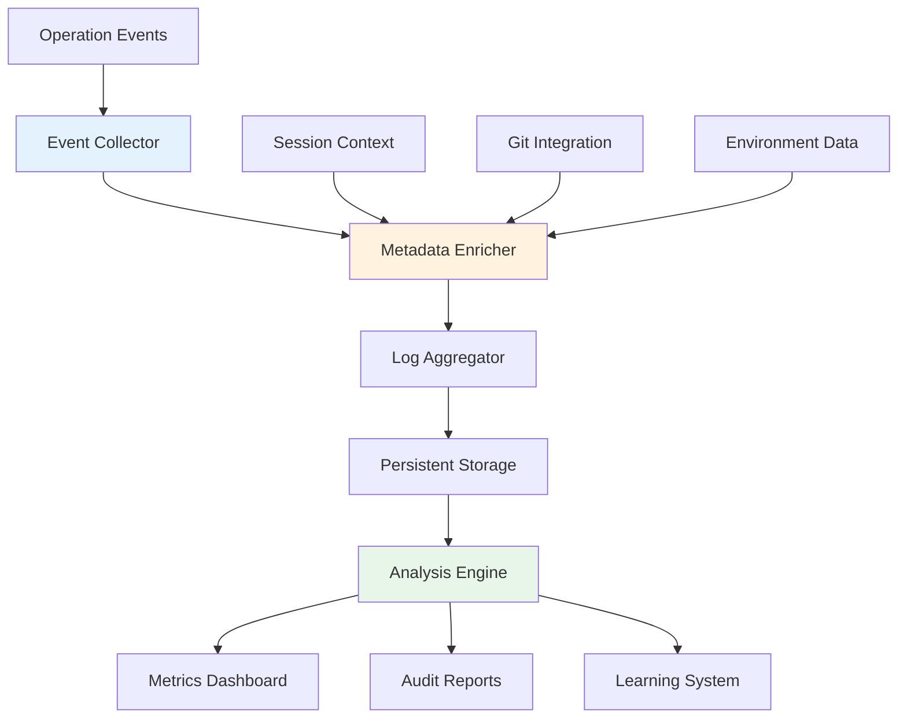

# Traceability System - Logging and Metadata Tracking

## Overview

Claude Code's traceability system provides comprehensive logging and metadata tracking throughout the code generation lifecycle. This system ensures complete auditability, reproducibility, and continuous improvement through detailed operational records.

## Architecture Overview

### System Components



## Metadata Structure

### Core Metadata Schema

```json
{
  "metadata_version": "1.0",
  "session": {
    "id": "uuid-v4",
    "start_time": "2024-01-15T10:30:00Z",
    "end_time": "2024-01-15T11:45:00Z",
    "user_id": "anonymous",
    "client_version": "claude-code-1.2.3"
  },
  "git_info": {
    "branch": "main",
    "commit": "abc123def456",
    "dirty": false,
    "remote_url": "https://github.com/user/repo.git",
    "author": "user@example.com"
  },
  "environment": {
    "os": "Linux",
    "python_version": "3.9.7",
    "node_version": "16.14.0",
    "working_directory": "/workspace",
    "timezone": "UTC",
    "locale": "en_US.UTF-8"
  },
  "operations": [],
  "validations": [],
  "metrics": {}
}
```

### Operation Record Schema

```json
{
  "operation_id": "op-uuid-v4",
  "timestamp": "2024-01-15T10:35:00Z",
  "type": "Write|Edit|MultiEdit|Bash|Task",
  "tool": "Write",
  "parameters": {
    "file_path": "/workspace/src/analyzer.py",
    "content_hash": "sha256:abc123...",
    "size_bytes": 2048
  },
  "validations": {
    "pre": [
      {
        "validator": "validate-code-style",
        "result": "pass",
        "duration_ms": 45,
        "details": {}
      }
    ],
    "post": [
      {
        "validator": "validate-docstrings",
        "result": "warning",
        "duration_ms": 120,
        "details": {
          "missing_docstrings": ["helper_function"]
        }
      }
    ]
  },
  "result": {
    "status": "success",
    "duration_ms": 350,
    "output": "File created successfully"
  }
}
```

## Logging Infrastructure

### Log Levels and Categories

```python
class LogCategory(Enum):
    VALIDATION = "validation"
    GENERATION = "generation"
    ORCHESTRATION = "orchestration"
    PERFORMANCE = "performance"
    SECURITY = "security"
    ERROR = "error"
    AUDIT = "audit"
```

### Structured Logging Format

```python
import structlog

logger = structlog.get_logger()

# Configure structured logging
structlog.configure(
    processors=[
        structlog.stdlib.filter_by_level,
        structlog.stdlib.add_logger_name,
        structlog.stdlib.add_log_level,
        structlog.stdlib.PositionalArgumentsFormatter(),
        structlog.processors.TimeStamper(fmt="iso"),
        structlog.processors.StackInfoRenderer(),
        structlog.processors.format_exc_info,
        structlog.processors.UnicodeDecoder(),
        structlog.processors.JSONRenderer()
    ],
    context_class=dict,
    logger_factory=structlog.stdlib.LoggerFactory(),
)
```

### Log Entry Examples

```json
{
  "timestamp": "2024-01-15T10:35:00.123Z",
  "level": "info",
  "category": "validation",
  "event": "validation_completed",
  "operation_id": "op-123",
  "validator": "validate-code-style",
  "file_path": "/workspace/src/analyzer.py",
  "duration_ms": 45,
  "result": "pass",
  "details": {
    "functions_checked": 5,
    "max_function_length": 35,
    "naming_violations": 0
  }
}
```

## Event Collection System

### Event Collectors

```python
class EventCollector:
    def __init__(self):
        self.buffer = []
        self.flush_interval = 1000  # ms
        self.max_buffer_size = 100
        
    def collect(self, event):
        enriched_event = self.enrich_event(event)
        self.buffer.append(enriched_event)
        
        if len(self.buffer) >= self.max_buffer_size:
            self.flush()
    
    def enrich_event(self, event):
        event['collected_at'] = datetime.utcnow().isoformat()
        event['session_id'] = self.get_session_id()
        event['sequence_number'] = self.get_next_sequence()
        return event
```

### Event Types

```python
EVENT_TYPES = {
    'user_input': UserInputEvent,
    'tool_invocation': ToolInvocationEvent,
    'validation_start': ValidationStartEvent,
    'validation_complete': ValidationCompleteEvent,
    'generation_start': GenerationStartEvent,
    'generation_complete': GenerationCompleteEvent,
    'error_occurred': ErrorEvent,
    'session_start': SessionStartEvent,
    'session_end': SessionEndEvent
}
```

## Metadata Enrichment

### Git Integration

```python
class GitMetadataEnricher:
    def enrich(self, metadata):
        try:
            repo = git.Repo(search_parent_directories=True)
            
            metadata['git'] = {
                'branch': repo.active_branch.name,
                'commit': repo.head.commit.hexsha,
                'commit_message': repo.head.commit.message.strip(),
                'author': str(repo.head.commit.author),
                'timestamp': repo.head.commit.committed_datetime.isoformat(),
                'dirty': repo.is_dirty(),
                'untracked': [str(f) for f in repo.untracked_files],
                'modified': [item.a_path for item in repo.index.diff(None)]
            }
            
            # Add remote info if available
            if repo.remotes:
                metadata['git']['remotes'] = {
                    remote.name: remote.url
                    for remote in repo.remotes
                }
                
        except Exception as e:
            metadata['git'] = {'error': str(e)}
            
        return metadata
```

### Environment Enrichment

```python
class EnvironmentEnricher:
    def enrich(self, metadata):
        metadata['environment'] = {
            'os': platform.system(),
            'os_version': platform.version(),
            'architecture': platform.machine(),
            'python_version': sys.version,
            'hostname': socket.gethostname(),
            'user': os.environ.get('USER', 'unknown'),
            'working_directory': os.getcwd(),
            'path': os.environ.get('PATH', '').split(':'),
            'timezone': time.tzname,
            'locale': locale.getlocale(),
            'encoding': sys.getdefaultencoding(),
            'cpu_count': os.cpu_count(),
            'memory_available': psutil.virtual_memory().available,
            'disk_usage': psutil.disk_usage('/').percent
        }
        
        # Add Claude-specific environment
        metadata['environment']['claude'] = {
            'version': self.get_claude_version(),
            'rules_loaded': self.get_loaded_rules(),
            'hooks_enabled': self.get_enabled_hooks(),
            'mcp_servers': self.get_mcp_servers()
        }
        
        return metadata
```

### Context Enrichment

```python
class ContextEnricher:
    def enrich(self, metadata, context):
        metadata['context'] = {
            'intent': context.detected_intent,
            'confidence': context.intent_confidence,
            'injected_rules': context.injected_rules,
            'active_templates': context.templates_used,
            'orchestration': {
                'used': context.used_orchestration,
                'workflow': context.workflow_type,
                'stages': context.stages_executed
            },
            'related_files': context.related_files,
            'previous_operations': context.recent_operations[-5:]
        }
        
        return metadata
```

## Persistent Storage

### Storage Strategy

```python
class MetadataStorage:
    def __init__(self):
        self.storage_path = Path("/workspace/.claude/logs")
        self.rotation_policy = RotationPolicy(
            max_size_mb=100,
            max_age_days=30,
            max_files=10
        )
    
    def store(self, metadata):
        # Create timestamped filename
        timestamp = datetime.utcnow().strftime("%Y%m%d_%H%M%S")
        filename = f"session_{metadata['session']['id']}_{timestamp}.json"
        
        # Ensure directory exists
        self.storage_path.mkdir(parents=True, exist_ok=True)
        
        # Write metadata
        file_path = self.storage_path / filename
        with open(file_path, 'w') as f:
            json.dump(metadata, f, indent=2)
        
        # Apply rotation policy
        self.rotation_policy.apply(self.storage_path)
```

### Log Rotation

```python
class RotationPolicy:
    def apply(self, log_directory):
        files = sorted(log_directory.glob("*.json"))
        
        # Remove old files
        cutoff_date = datetime.now() - timedelta(days=self.max_age_days)
        for file in files:
            if file.stat().st_mtime < cutoff_date.timestamp():
                file.unlink()
        
        # Check total size
        total_size = sum(f.stat().st_size for f in files)
        if total_size > self.max_size_mb * 1024 * 1024:
            # Remove oldest files
            for file in files[:-self.max_files]:
                file.unlink()
```

## Analysis Engine

### Metrics Extraction

```python
class MetricsExtractor:
    def extract_session_metrics(self, session_data):
        metrics = {
            'duration': self.calculate_duration(session_data),
            'operations': {
                'total': len(session_data['operations']),
                'by_type': self.count_by_type(session_data['operations']),
                'success_rate': self.calculate_success_rate(session_data)
            },
            'validations': {
                'total': self.count_validations(session_data),
                'pass_rate': self.calculate_validation_pass_rate(session_data),
                'average_duration': self.average_validation_duration(session_data)
            },
            'performance': {
                'average_operation_time': self.average_operation_time(session_data),
                'slowest_operations': self.find_slowest_operations(session_data, limit=5)
            },
            'errors': self.extract_error_metrics(session_data)
        }
        
        return metrics
```

### Pattern Analysis

```python
class PatternAnalyzer:
    def analyze_patterns(self, sessions):
        patterns = {
            'common_workflows': self.identify_workflow_patterns(sessions),
            'error_patterns': self.identify_error_patterns(sessions),
            'performance_patterns': self.identify_performance_patterns(sessions),
            'validation_failures': self.analyze_validation_failures(sessions)
        }
        
        # Identify improvement opportunities
        patterns['improvements'] = self.suggest_improvements(patterns)
        
        return patterns
```

## Audit Trail

### Compliance Tracking

```python
class ComplianceTracker:
    def track_compliance(self, operation):
        compliance_record = {
            'timestamp': datetime.utcnow().isoformat(),
            'operation_id': operation.id,
            'rules_checked': [],
            'violations': [],
            'compliance_score': 0.0
        }
        
        # Check each rule
        for rule in self.get_applicable_rules(operation):
            result = rule.check(operation)
            compliance_record['rules_checked'].append({
                'rule_id': rule.id,
                'rule_name': rule.name,
                'result': result.status,
                'details': result.details
            })
            
            if result.status == 'violation':
                compliance_record['violations'].append(rule.id)
        
        # Calculate compliance score
        compliance_record['compliance_score'] = self.calculate_score(
            compliance_record
        )
        
        return compliance_record
```

### Security Audit

```python
class SecurityAuditor:
    def audit_operation(self, operation):
        audit_record = {
            'operation_id': operation.id,
            'security_checks': [],
            'risk_level': 'low',
            'alerts': []
        }
        
        # Check for sensitive operations
        if self.is_sensitive_operation(operation):
            audit_record['security_checks'].append({
                'check': 'sensitive_operation',
                'result': 'flagged',
                'reason': 'Operation touches sensitive files'
            })
            audit_record['risk_level'] = 'medium'
        
        # Check for suspicious patterns
        suspicious = self.check_suspicious_patterns(operation)
        if suspicious:
            audit_record['alerts'].extend(suspicious)
            audit_record['risk_level'] = 'high'
        
        return audit_record
```

## Reporting System

### Session Reports

```python
class SessionReporter:
    def generate_report(self, session_id):
        session_data = self.load_session_data(session_id)
        
        report = {
            'summary': self.generate_summary(session_data),
            'operations': self.summarize_operations(session_data),
            'validations': self.summarize_validations(session_data),
            'performance': self.analyze_performance(session_data),
            'compliance': self.assess_compliance(session_data),
            'recommendations': self.generate_recommendations(session_data)
        }
        
        return self.format_report(report)
```

### Aggregate Reports

```python
class AggregateReporter:
    def generate_weekly_report(self):
        sessions = self.get_sessions_for_period(days=7)
        
        report = {
            'period': 'weekly',
            'total_sessions': len(sessions),
            'total_operations': sum(len(s['operations']) for s in sessions),
            'success_rate': self.calculate_aggregate_success_rate(sessions),
            'common_errors': self.identify_common_errors(sessions),
            'performance_trends': self.analyze_performance_trends(sessions),
            'rule_violations': self.aggregate_rule_violations(sessions),
            'usage_patterns': self.analyze_usage_patterns(sessions)
        }
        
        return report
```

## Privacy and Security

### Data Sanitization

```python
class DataSanitizer:
    def sanitize(self, data):
        # Remove sensitive paths
        data = self.sanitize_paths(data)
        
        # Remove credentials
        data = self.remove_credentials(data)
        
        # Anonymize user data
        data = self.anonymize_user_data(data)
        
        # Hash sensitive content
        data = self.hash_sensitive_content(data)
        
        return data
    
    def sanitize_paths(self, data):
        # Replace absolute paths with relative
        home_dir = Path.home()
        data_str = json.dumps(data)
        data_str = data_str.replace(str(home_dir), "~")
        return json.loads(data_str)
```

### Access Control

```python
class AccessController:
    def __init__(self):
        self.permissions = {
            'read_logs': ['admin', 'developer'],
            'read_metrics': ['admin', 'developer', 'analyst'],
            'delete_logs': ['admin'],
            'export_data': ['admin', 'analyst']
        }
    
    def can_access(self, user_role, action):
        allowed_roles = self.permissions.get(action, [])
        return user_role in allowed_roles
```

## Integration Points

### CI/CD Integration

```python
class CICDIntegration:
    def export_metrics_for_ci(self, session_id):
        metrics = self.extract_session_metrics(session_id)
        
        # Format for CI systems
        ci_metrics = {
            'code_quality': {
                'compliance_score': metrics['compliance']['score'],
                'validation_pass_rate': metrics['validations']['pass_rate'],
                'error_rate': metrics['errors']['rate']
            },
            'performance': {
                'average_operation_time': metrics['performance']['avg_time'],
                'total_duration': metrics['duration']
            },
            'coverage': {
                'rules_coverage': metrics['compliance']['rules_coverage'],
                'test_coverage': metrics.get('test_coverage', 0)
            }
        }
        
        return ci_metrics
```

### Monitoring Integration

```python
class MonitoringIntegration:
    def export_to_prometheus(self):
        # Export metrics in Prometheus format
        metrics = []
        
        metrics.append(
            f'claude_code_operations_total{{type="write"}} {self.count_operations("write")}'
        )
        metrics.append(
            f'claude_code_validation_duration_seconds {self.avg_validation_duration()}'
        )
        metrics.append(
            f'claude_code_compliance_score {self.current_compliance_score()}'
        )
        
        return '\n'.join(metrics)
```

## Best Practices

### Logging Guidelines

1. **Structured Logging**: Always use structured format
2. **Appropriate Levels**: Use correct log levels
3. **Contextual Information**: Include relevant context
4. **Performance Impact**: Minimize logging overhead

### Metadata Collection

1. **Minimal PII**: Avoid collecting personal data
2. **Relevant Context**: Include useful debugging info
3. **Efficient Storage**: Compress old logs
4. **Regular Cleanup**: Implement retention policies

### Analysis and Reporting

1. **Actionable Insights**: Focus on improvements
2. **Trend Analysis**: Track changes over time
3. **Anomaly Detection**: Alert on unusual patterns
4. **Privacy First**: Anonymize sensitive data

## Conclusion

Claude Code's traceability system provides comprehensive visibility into every aspect of the code generation process. Through detailed logging, rich metadata collection, and sophisticated analysis capabilities, it enables continuous improvement, ensures compliance, and provides valuable insights into system usage and performance. The system's privacy-conscious design and integration capabilities make it suitable for both individual and enterprise use cases.