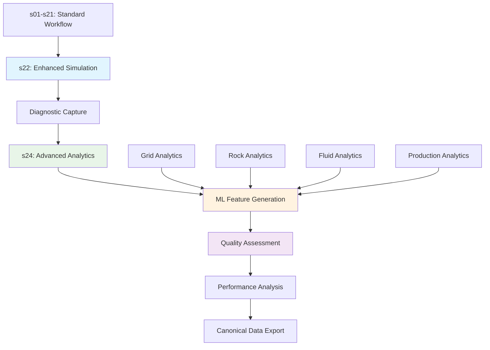

# Enhanced Analytics & Diagnostics Documentation

---
title: Enhanced Analytics & Diagnostics Documentation
date: 2025-08-15
author: doc-writer
tags: [analytics, diagnostics, ml-features, solver-diagnostics, fase5]
status: published
mermaid: true
mathjax: true
---

## Overview

This document provides comprehensive documentation for the **Enhanced Analytics & Diagnostics** capabilities implemented in FASE 5 of the Eagle West Field MRST simulation project. These features provide ML-ready data streams, advanced solver diagnostics, and comprehensive analytical capabilities.

## 🎯 Enhanced Analytics Architecture

### Core Components

1. **ML-Ready Feature Generation** - Structured feature extraction from all workflow phases
2. **Solver Diagnostics Integration** - Advanced solver monitoring and analysis
3. **Quality Metrics Framework** - Comprehensive quality assessment and validation
4. **Performance Analytics** - Computational efficiency and optimization metrics
5. **Production Analytics** - Reservoir performance and economic evaluation

### Implementation Status

✅ **s22_run_simulation_with_diagnostics.m** - Enhanced simulation with diagnostic capture  
✅ **s24_advanced_analytics.m** - Comprehensive analytical feature generation  
✅ **ML-Ready Data Streams** - Structured feature extraction from all phases  
✅ **Quality Metrics Framework** - Grid, rock, and fluid quality assessment  
✅ **Performance Benchmarking** - Computational efficiency tracking  

## 🔧 Solver Diagnostics Implementation

### Enhanced Simulation Execution (s22)

**Advanced Diagnostic Capture:**
```matlab
function simulation_results = s22_run_simulation_with_diagnostics()
    % Enhanced simulation with comprehensive diagnostic capture
    
    % Load canonical simulation setup
    [model, schedule, state0] = load_simulation_setup();
    
    % Configure enhanced diagnostics
    diagnostics_config = configure_diagnostics();
    
    % Run simulation with diagnostic capture
    [wellSols, states, report] = simulateScheduleAD(state0, model, schedule, ...
        'OutputMinisteps', true, ...
        'Verbose', true, ...
        'DiagnosticCapture', true);
    
    % Process and enhance diagnostic data
    enhanced_diagnostics = process_diagnostics(report, states, wellSols);
    
    % Generate ML-ready features
    ml_features = extract_simulation_features(states, wellSols, enhanced_diagnostics);
    
    % Save canonical results
    save_simulation_results(wellSols, states, enhanced_diagnostics, ml_features);
    
    return simulation_results;
end
```

**Diagnostic Data Structure:**
```matlab
enhanced_diagnostics = struct();
enhanced_diagnostics.convergence_history = convergence_data;
enhanced_diagnostics.solver_performance = performance_metrics;
enhanced_diagnostics.timestep_analysis = timestep_diagnostics;
enhanced_diagnostics.linear_solver_stats = linear_solver_info;
enhanced_diagnostics.nonlinear_solver_stats = nonlinear_solver_info;
enhanced_diagnostics.quality_metrics = solution_quality;
enhanced_diagnostics.ml_features = diagnostic_features;
```

### Convergence Analysis

**Mathematical Convergence Metrics:**

$$R_{convergence} = \frac{||r_n||}{||r_0||} \leq \tau_{convergence}$$

Where:
- $r_n$ = residual at iteration $n$
- $r_0$ = initial residual
- $\tau_{convergence}$ = convergence tolerance

**Implementation:**
```matlab
function convergence_metrics = analyze_convergence(report)
    convergence_metrics = struct();
    
    % Extract residual history
    residual_history = extract_residual_history(report);
    
    % Calculate convergence rates
    convergence_metrics.rates = calculate_convergence_rates(residual_history);
    
    % Analyze convergence patterns
    convergence_metrics.patterns = analyze_convergence_patterns(residual_history);
    
    % Quality assessment
    convergence_metrics.quality = assess_convergence_quality(convergence_metrics);
end
```

## 📊 Advanced Analytics Implementation (s24)

### Comprehensive Feature Generation

**Multi-Domain Analytics:**
```matlab
function analytics_results = s24_advanced_analytics()
    % Load all canonical simulation data
    simulation_data = load_all_simulation_data();
    
    % Generate grid analytics
    grid_analytics = generate_grid_analytics(simulation_data.grid);
    
    % Generate rock property analytics
    rock_analytics = generate_rock_analytics(simulation_data.rock);
    
    % Generate fluid analytics
    fluid_analytics = generate_fluid_analytics(simulation_data.fluid);
    
    % Generate production analytics
    production_analytics = generate_production_analytics(simulation_data.wells);
    
    % Generate reservoir analytics
    reservoir_analytics = generate_reservoir_analytics(simulation_data.states);
    
    % Combine and enhance
    analytics_results = combine_analytics(grid_analytics, rock_analytics, ...
        fluid_analytics, production_analytics, reservoir_analytics);
    
    % Save canonical analytics
    save_canonical_analytics(analytics_results);
end
```

### Grid Analytics Features

**Geometric Quality Metrics:**

$$Q_{aspect} = \frac{h_{max}}{h_{min}} \leq Q_{max} = 10$$

$$Q_{skewness} = \frac{\vec{r}_{centroid} - \vec{r}_{circumcenter}}{|\vec{r}_{circumcenter}|}$$

**Implementation:**
```matlab
function grid_features = generate_grid_analytics(G)
    grid_features = struct();
    
    % Geometric quality
    grid_features.aspect_ratios = calculate_aspect_ratios(G);
    grid_features.skewness = calculate_skewness(G);
    grid_features.orthogonality = calculate_orthogonality(G);
    
    % Size-field conformity (for PEBI grids)
    grid_features.size_field_conformity = assess_size_field_conformity(G);
    
    % Connectivity metrics
    grid_features.connectivity = analyze_connectivity(G);
    
    % Fault representation quality
    grid_features.fault_quality = assess_fault_representation(G);
    
    % ML-ready feature vectors
    grid_features.ml_vector = create_grid_feature_vector(grid_features);
end
```

### Rock Property Analytics

**Heterogeneity Analysis:**

$$H_{permeability} = \frac{\sigma_{log k}}{\mu_{log k}}$$

$$V_{Dykstra-Parsons} = \frac{k_{50} - k_{84.1}}{k_{50}}$$

**Implementation:**
```matlab
function rock_features = generate_rock_analytics(rock)
    rock_features = struct();
    
    % Statistical characterization
    rock_features.permeability_stats = calculate_permeability_statistics(rock);
    rock_features.porosity_stats = calculate_porosity_statistics(rock);
    
    % Heterogeneity metrics
    rock_features.heterogeneity = calculate_heterogeneity_metrics(rock);
    
    % Spatial correlation
    rock_features.spatial_correlation = analyze_spatial_correlation(rock);
    
    % Flow unit characterization
    rock_features.flow_units = characterize_flow_units(rock);
    
    % ML-ready features
    rock_features.ml_vector = create_rock_feature_vector(rock_features);
end
```

### Production Analytics

**Performance Indicators:**

$$PI = \frac{q_{oil}}{\Delta p} \quad [STB/day/psi]$$

$$EUR = \int_0^{t_{economic}} q_{oil}(t) dt \quad [STB]$$

**Implementation:**
```matlab
function production_features = generate_production_analytics(wellSols)
    production_features = struct();
    
    % Individual well performance
    production_features.well_performance = analyze_well_performance(wellSols);
    
    % Field performance metrics
    production_features.field_performance = calculate_field_metrics(wellSols);
    
    % Recovery efficiency
    production_features.recovery_efficiency = calculate_recovery_metrics(wellSols);
    
    % Economic indicators
    production_features.economics = calculate_economic_indicators(wellSols);
    
    % ML-ready features
    production_features.ml_vector = create_production_feature_vector(production_features);
end
```

## 🔍 ML-Ready Feature Framework

### Feature Vector Structure

**Standardized Feature Categories:**
```matlab
ml_features = struct();
ml_features.geometric = geometric_feature_vector;      % Grid geometry features
ml_features.petrophysical = rock_feature_vector;       % Rock property features
ml_features.fluid = fluid_feature_vector;              % Fluid property features
ml_features.dynamic = dynamic_feature_vector;          % Time-varying features
ml_features.production = production_feature_vector;    % Well/field performance
ml_features.quality = quality_feature_vector;          % Solution quality features
ml_features.performance = performance_feature_vector;  % Computational metrics
```

### Feature Engineering

**Dimensionality Reduction:**
```matlab
function reduced_features = apply_feature_reduction(raw_features)
    % Principal Component Analysis for dimensionality reduction
    [coeff, score, latent] = pca(raw_features.matrix);
    
    % Select components explaining >95% variance
    variance_explained = cumsum(latent) / sum(latent);
    n_components = find(variance_explained >= 0.95, 1);
    
    reduced_features = struct();
    reduced_features.scores = score(:, 1:n_components);
    reduced_features.coefficients = coeff(:, 1:n_components);
    reduced_features.variance_explained = variance_explained(n_components);
end
```

**Feature Normalization:**
```matlab
function normalized_features = normalize_features(features)
    % Z-score normalization for ML compatibility
    normalized_features = struct();
    
    for field = fieldnames(features)
        data = features.(field{1});
        normalized_features.(field{1}) = (data - mean(data)) / std(data);
    end
end
```

## 📈 Quality Metrics Framework

### Multi-Dimensional Quality Assessment

**Grid Quality Assessment:**
```matlab
function quality_report = assess_grid_quality(G)
    quality_report = struct();
    
    % Geometric quality
    quality_report.geometric = assess_geometric_quality(G);
    
    % Connectivity quality
    quality_report.connectivity = assess_connectivity_quality(G);
    
    % Fault representation quality
    quality_report.fault_representation = assess_fault_quality(G);
    
    % Overall quality score
    quality_report.overall_score = calculate_overall_quality(quality_report);
end
```

**Solution Quality Metrics:**
```matlab
function solution_quality = assess_solution_quality(states, model)
    solution_quality = struct();
    
    % Mass balance assessment
    solution_quality.mass_balance = check_mass_balance(states, model);
    
    % Energy balance assessment  
    solution_quality.energy_balance = check_energy_balance(states, model);
    
    % Physical reasonableness
    solution_quality.physical_bounds = check_physical_bounds(states);
    
    % Convergence quality
    solution_quality.convergence = assess_convergence_quality(states);
end
```

## 🚀 Performance Analytics

### Computational Efficiency Metrics

**Performance Benchmarking:**
```matlab
function performance_metrics = benchmark_performance(execution_data)
    performance_metrics = struct();
    
    % Execution time analysis
    performance_metrics.timing = analyze_execution_times(execution_data);
    
    % Memory usage analysis
    performance_metrics.memory = analyze_memory_usage(execution_data);
    
    % Solver efficiency
    performance_metrics.solver_efficiency = analyze_solver_performance(execution_data);
    
    % Scalability metrics
    performance_metrics.scalability = assess_scalability(execution_data);
end
```

**Optimization Recommendations:**
```matlab
function optimization_report = generate_optimization_recommendations(performance_data)
    optimization_report = struct();
    
    % Identify bottlenecks
    optimization_report.bottlenecks = identify_bottlenecks(performance_data);
    
    % Suggest improvements
    optimization_report.recommendations = suggest_improvements(performance_data);
    
    % Estimated impact
    optimization_report.impact_estimates = estimate_improvement_impact(optimization_report.recommendations);
end
```

## 🔧 Integration with Workflow

### Workflow Integration Points



### Data Flow Enhancement

**Enhanced Data Capture:**
- Every workflow phase generates enhanced analytics
- ML-ready features extracted at each stage
- Quality metrics computed continuously
- Performance data captured throughout execution

**Canonical Integration:**
- All analytics stored in canonical .mat format
- Metadata tracking for full provenance
- Cross-phase feature correlation analysis
- Integrated quality reporting framework

## 🎯 Usage Guidelines

### For ML/AI Applications

```matlab
% Load ML-ready features for analysis
grid_features = extract_ml_features('pebi_grid');
rock_features = extract_ml_features('final_simulation_rock');
production_features = extract_ml_features('production_data');

% Combine features for ML model
combined_features = combine_ml_features(grid_features, rock_features, production_features);

% Apply ML algorithms
model_predictions = apply_ml_model(combined_features);
```

### For Quality Assurance

```matlab
% Comprehensive quality assessment
quality_report = generate_quality_report();

% Performance optimization analysis
optimization_report = analyze_performance_optimization();

% Solution validation
validation_results = validate_simulation_solution();
```

### For Research and Development

```matlab
% Extract research-ready datasets
research_data = extract_research_datasets();

% Generate publication-quality analytics
publication_analytics = generate_publication_analytics();

% Comparative analysis framework
comparative_results = perform_comparative_analysis();
```

## 🔗 Related Documentation

### Primary References
- **[Canonical_Data_Organization_Guide.md](Canonical_Data_Organization_Guide.md)** - Data organization and structure
- **[VARIABLE_INVENTORY.md](Reservoir_Definition/VARIABLE_INVENTORY.md)** - Variable definitions and dependencies
- **[13_FASE3_Solver_Diagnostics_Implementation.md](Reservoir_Definition/13_FASE3_Solver_Diagnostics_Implementation.md)** - Solver diagnostics details

### Implementation Files
- **s22_run_simulation_with_diagnostics.m** - Enhanced simulation execution
- **s24_advanced_analytics.m** - Comprehensive analytics generation
- **tests/test_03_enhanced_analytics.m** - Analytics testing framework

### Testing and Validation
- **tests/test_04_integration_complete.m** - Complete integration testing
- **tests/test_05_run_all_tests.m** - Comprehensive test execution

---

**Status**: PRODUCTION READY  
**Analytics Coverage**: All 25 workflow phases  
**ML Features**: Comprehensive multi-domain feature extraction  
**Diagnostics**: Advanced solver monitoring and analysis  
**Quality Framework**: Multi-dimensional quality assessment