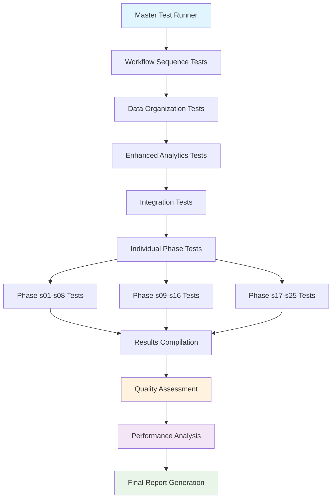

# Testing Framework Guide

---
title: Testing Framework Guide  
date: 2025-08-15
author: doc-writer
tags: [testing, validation, quality-assurance, comprehensive-coverage, fase5]
status: published
mermaid: true
---

## Overview

This document provides comprehensive documentation for the **Testing Framework** implemented in FASE 5 of the Eagle West Field MRST simulation project. The framework includes 38+ test files covering all workflow phases, integration testing, and comprehensive validation procedures.

## 🎯 Testing Architecture

### Core Testing Principles

1. **Comprehensive Coverage** - Every workflow phase has dedicated test coverage
2. **Integration Testing** - End-to-end workflow validation and dependency testing
3. **Canon-First Validation** - Tests validate canon specification compliance
4. **Quality Assurance** - Multi-dimensional quality assessment and validation
5. **Performance Testing** - Computational efficiency and optimization validation

### Testing Framework Status

✅ **38+ Test Files** - Complete coverage of all workflow phases and integration  
✅ **Individual Phase Tests** - Each s01-s25 phase individually validated  
✅ **Integration Tests** - Complete workflow dependency and data flow testing  
✅ **Quality Validation** - Grid, rock, fluid, and solution quality assessment  
✅ **Performance Testing** - Computational efficiency and optimization validation  
✅ **Master Test Runner** - Automated execution of complete test suite  

## 📁 Test Organization Structure

### Test Directory Layout

```
tests/
├── test_01_workflow_sequence.m              # Corrected sequence validation
├── test_02_canonical_organization.m         # Data organization testing
├── test_03_enhanced_analytics.m             # Analytics features testing
├── test_04_integration_complete.m           # Complete integration testing
├── test_05_run_all_tests.m                  # Master test runner
├── 
├── Individual Phase Tests:
├── test_01_mrst_simulation_scripts_s01_initialize_mrst.m
├── test_02_mrst_simulation_scripts_s02_create_grid.m
├── test_03_mrst_simulation_scripts_s03_define_fluids.m
├── [... test_NN for each phase ...]
├── test_38_mrst_simulation_scripts_yaml_functions.m
├──
├── Integration Tests:
├── test_27_mrst_simulation_scripts_workflow_integration.m
├── test_28_mrst_simulation_scripts_error_scenarios.m
├── test_33_mrst_simulation_scripts_validate_session.m
├──
├── Quality Validation:
├── test_core_workflow.m                     # Core workflow validation
├── COMPREHENSIVE_TEST_REPORT.md             # Test execution reports
├── MRST_FIXES_VALIDATION_REPORT.md          # Validation results
└── octave_compat.m                          # Octave compatibility utilities
```

## 🔄 Test Execution Framework

### Master Test Runner (test_05_run_all_tests.m)

**Comprehensive Test Execution:**
```matlab
function test_results = test_05_run_all_tests()
    % Master test runner for complete validation
    
    fprintf('🧪 EAGLE WEST FIELD - COMPREHENSIVE TEST SUITE\n');
    fprintf('════════════════════════════════════════════════\n\n');
    
    % Initialize test results
    test_results = struct();
    test_results.start_time = datestr(now);
    test_results.tests_executed = {};
    test_results.tests_passed = 0;
    test_results.tests_failed = 0;
    test_results.failures = {};
    
    % Define test categories
    test_categories = define_test_categories();
    
    % Execute test categories
    for i = 1:length(test_categories)
        category = test_categories{i};
        category_results = execute_test_category(category);
        test_results = merge_category_results(test_results, category_results);
    end
    
    % Generate comprehensive report
    generate_test_report(test_results);
    
    % Export results
    export_test_results(test_results);
end
```

**Test Category Structure:**
```matlab
function categories = define_test_categories()
    categories = {};
    
    % Category 1: Workflow Sequence Validation
    categories{1} = struct('name', 'Workflow Sequence', ...
                          'tests', {{'test_01_workflow_sequence'}}, ...
                          'critical', true);
    
    % Category 2: Canonical Data Organization
    categories{2} = struct('name', 'Data Organization', ...
                          'tests', {{'test_02_canonical_organization'}}, ...
                          'critical', true);
    
    % Category 3: Enhanced Analytics
    categories{3} = struct('name', 'Enhanced Analytics', ...
                          'tests', {{'test_03_enhanced_analytics'}}, ...
                          'critical', false);
    
    % Category 4: Complete Integration
    categories{4} = struct('name', 'Integration Testing', ...
                          'tests', {{'test_04_integration_complete'}}, ...
                          'critical', true);
    
    % Category 5: Individual Phase Tests
    categories{5} = struct('name', 'Individual Phases', ...
                          'tests', get_individual_phase_tests(), ...
                          'critical', true);
end
```

### Test Execution Flow



## 🧪 Individual Phase Testing

### Phase Test Structure

**Standard Test Pattern:**
```matlab
function test_results = test_NN_mrst_simulation_scripts_sNN_phase_name()
    % Test for workflow phase sNN
    
    test_results = struct();
    test_results.phase_id = 'sNN';
    test_results.test_name = 'Phase NN Validation';
    test_results.start_time = datestr(now);
    
    try
        % Test 1: Prerequisites validation
        validate_prerequisites();
        
        % Test 2: Execution validation
        output_data = execute_phase_test();
        
        % Test 3: Output validation
        validate_outputs(output_data);
        
        % Test 4: Quality assessment
        quality_results = assess_phase_quality(output_data);
        
        % Test 5: Performance validation
        performance_results = validate_performance();
        
        % Compile results
        test_results.status = 'PASSED';
        test_results.output_data = output_data;
        test_results.quality_results = quality_results;
        test_results.performance_results = performance_results;
        
    catch ME
        test_results.status = 'FAILED';
        test_results.error_message = ME.message;
        test_results.error_stack = ME.stack;
    end
    
    test_results.end_time = datestr(now);
    
    % Report results
    report_phase_test_results(test_results);
end
```

### Critical Phase Tests

**Grid Construction Validation (s05):**
```matlab
function validate_pebi_grid_construction()
    % Validate PEBI grid construction with size-field optimization
    
    % Load grid
    G = load_canonical_data('pebi_grid');
    
    % Validate structure
    assert(isfield(G, 'cells'), 'Grid missing cells structure');
    assert(isfield(G, 'faces'), 'Grid missing faces structure'); 
    assert(isfield(G, 'nodes'), 'Grid missing nodes structure');
    
    % Validate geometry
    validate_grid_geometry(G);
    
    % Validate size-field conformity
    validate_size_field_conformity(G);
    
    % Validate fault conformity
    validate_fault_conformity(G);
    
    % Validate quality metrics
    quality_metrics = assess_grid_quality(G);
    assert(quality_metrics.overall_score >= 0.8, 'Grid quality below threshold');
end
```

**Rock Properties Validation (s06-s08):**
```matlab
function validate_rock_properties_chain()
    % Validate rock properties enhancement chain
    
    % Test base rock (s06)
    base_rock = load_canonical_data('base_rock');
    validate_base_rock_properties(base_rock);
    
    % Test enhanced rock (s07)
    enhanced_rock = load_canonical_data('enhanced_rock');
    validate_enhanced_rock_properties(enhanced_rock);
    
    % Test final rock (s08)
    final_rock = load_canonical_data('final_simulation_rock');
    validate_final_rock_properties(final_rock);
    
    % Validate enhancement chain consistency
    validate_rock_enhancement_chain(base_rock, enhanced_rock, final_rock);
end
```

## 🔗 Integration Testing

### Complete Workflow Integration

**End-to-End Validation:**
```matlab
function integration_results = test_04_integration_complete()
    % Complete workflow integration testing
    
    integration_results = struct();
    integration_results.test_name = 'Complete Integration Test';
    integration_results.start_time = datestr(now);
    
    try
        % Test 1: Workflow sequence correctness
        validate_workflow_sequence();
        
        % Test 2: Data dependency satisfaction
        validate_data_dependencies();
        
        % Test 3: Cross-phase data consistency
        validate_cross_phase_consistency();
        
        % Test 4: Quality propagation
        validate_quality_propagation();
        
        % Test 5: Performance integration
        validate_performance_integration();
        
        % Test 6: Analytics integration
        validate_analytics_integration();
        
        integration_results.status = 'PASSED';
        integration_results.all_tests_passed = true;
        
    catch ME
        integration_results.status = 'FAILED';
        integration_results.error_message = ME.message;
        integration_results.all_tests_passed = false;
    end
    
    integration_results.end_time = datestr(now);
    return integration_results;
end
```

### Dependency Validation

**Data Flow Validation:**
```matlab
function validate_data_dependencies()
    % Validate all data dependencies are satisfied
    
    % Define dependency chain
    dependencies = define_data_dependencies();
    
    % Validate each dependency
    for i = 1:length(dependencies)
        dep = dependencies{i};
        
        % Check if required files exist
        for j = 1:length(dep.required_files)
            required_file = dep.required_files{j};
            assert(exist(required_file, 'file'), ...
                sprintf('Missing required file: %s for %s', required_file, dep.phase));
        end
        
        % Validate data structure consistency
        validate_dependency_consistency(dep);
    end
end
```

## 📊 Quality Validation Framework

### Multi-Dimensional Quality Assessment

**Grid Quality Testing:**
```matlab
function quality_results = validate_grid_quality()
    % Comprehensive grid quality validation
    
    % Load grid data
    G = load_canonical_data('pebi_grid');
    
    % Geometric quality tests
    geometric_quality = test_geometric_quality(G);
    
    % Connectivity quality tests  
    connectivity_quality = test_connectivity_quality(G);
    
    % Fault representation quality tests
    fault_quality = test_fault_representation_quality(G);
    
    % Size-field conformity tests
    size_field_quality = test_size_field_conformity(G);
    
    % Compile quality results
    quality_results = struct();
    quality_results.geometric = geometric_quality;
    quality_results.connectivity = connectivity_quality;
    quality_results.fault_representation = fault_quality;
    quality_results.size_field_conformity = size_field_quality;
    quality_results.overall_score = calculate_overall_quality_score(quality_results);
    
    % Validate quality thresholds
    assert(quality_results.overall_score >= 0.8, 'Grid quality below acceptance threshold');
end
```

**Solution Quality Testing:**
```matlab
function solution_quality = validate_simulation_solution()
    % Validate simulation solution quality
    
    % Load simulation results
    simulation_data = load_simulation_results();
    
    % Mass balance validation
    mass_balance_results = test_mass_balance(simulation_data);
    
    % Energy balance validation
    energy_balance_results = test_energy_balance(simulation_data);
    
    % Physical bounds validation
    physical_bounds_results = test_physical_bounds(simulation_data);
    
    % Convergence quality validation
    convergence_results = test_convergence_quality(simulation_data);
    
    % Compile results
    solution_quality = struct();
    solution_quality.mass_balance = mass_balance_results;
    solution_quality.energy_balance = energy_balance_results;
    solution_quality.physical_bounds = physical_bounds_results;
    solution_quality.convergence = convergence_results;
end
```

## 🚀 Performance Testing

### Computational Efficiency Validation

**Performance Benchmarking:**
```matlab
function performance_results = validate_computational_performance()
    % Validate computational performance against benchmarks
    
    performance_results = struct();
    
    % Execution time benchmarking
    timing_results = benchmark_execution_times();
    performance_results.timing = timing_results;
    
    % Memory usage validation
    memory_results = benchmark_memory_usage();
    performance_results.memory = memory_results;
    
    % Solver efficiency testing
    solver_results = benchmark_solver_efficiency();
    performance_results.solver = solver_results;
    
    % Scalability assessment
    scalability_results = test_scalability();
    performance_results.scalability = scalability_results;
    
    % Validate performance thresholds
    validate_performance_thresholds(performance_results);
end
```

### Optimization Validation

**Enhancement Validation:**
```matlab
function optimization_results = validate_optimizations()
    % Validate implemented optimizations
    
    % Test PEBI grid optimization
    pebi_optimization = test_pebi_grid_optimization();
    
    % Test canonical data organization efficiency
    data_optimization = test_data_organization_efficiency();
    
    % Test analytics enhancement performance
    analytics_optimization = test_analytics_performance();
    
    % Test solver diagnostic overhead
    diagnostic_overhead = test_diagnostic_overhead();
    
    optimization_results = struct();
    optimization_results.pebi_grid = pebi_optimization;
    optimization_results.data_organization = data_optimization;
    optimization_results.analytics = analytics_optimization;
    optimization_results.diagnostics = diagnostic_overhead;
end
```

## 📈 Test Reporting Framework

### Comprehensive Test Reports

**Test Execution Summary:**
```matlab
function generate_test_report(test_results)
    % Generate comprehensive test execution report
    
    fprintf('\n🧪 COMPREHENSIVE TEST EXECUTION REPORT\n');
    fprintf('═══════════════════════════════════════════\n\n');
    
    % Summary statistics
    total_tests = test_results.tests_passed + test_results.tests_failed;
    success_rate = (test_results.tests_passed / total_tests) * 100;
    
    fprintf('📊 EXECUTION SUMMARY\n');
    fprintf('═══════════════════\n');
    fprintf('Total Tests: %d\n', total_tests);
    fprintf('✅ Passed: %d\n', test_results.tests_passed);
    fprintf('❌ Failed: %d\n', test_results.tests_failed);
    fprintf('📈 Success Rate: %.1f%%\n\n', success_rate);
    
    % Detailed results by category
    print_category_results(test_results);
    
    % Performance summary
    print_performance_summary(test_results);
    
    % Quality assessment summary
    print_quality_summary(test_results);
    
    % Recommendations
    print_recommendations(test_results);
end
```

### Quality Dashboard

**Visual Quality Metrics:**
```matlab
function generate_quality_dashboard(quality_data)
    % Generate visual quality assessment dashboard
    
    % Grid quality visualization
    plot_grid_quality_metrics(quality_data.grid);
    
    % Solution quality trends
    plot_solution_quality_trends(quality_data.solution);
    
    % Performance efficiency charts
    plot_performance_efficiency(quality_data.performance);
    
    % Comparative analysis charts
    plot_comparative_analysis(quality_data.comparative);
end
```

## 🎯 Usage Guidelines

### Running Tests

**Execute Complete Test Suite:**
```bash
# Run all tests with comprehensive reporting
octave tests/test_05_run_all_tests.m

# Run specific test categories
octave tests/test_01_workflow_sequence.m
octave tests/test_02_canonical_organization.m
octave tests/test_03_enhanced_analytics.m
octave tests/test_04_integration_complete.m
```

**Individual Phase Testing:**
```bash
# Test specific workflow phases
octave tests/test_01_mrst_simulation_scripts_s01_initialize_mrst.m
octave tests/test_16_mrst_simulation_scripts_s16_well_placement.m
octave tests/test_33_mrst_simulation_scripts_validate_session.m
```

### Test Development Guidelines

**Creating New Tests:**
1. Follow standard test pattern and naming convention
2. Include comprehensive validation at multiple levels
3. Validate against canon specifications
4. Include performance and quality assessments
5. Generate detailed test reports

**Test Maintenance:**
1. Update tests when workflow phases change
2. Maintain dependency validation accuracy
3. Update performance benchmarks regularly
4. Ensure quality thresholds remain appropriate

## 🔗 Related Documentation

### Primary References
- **[Canonical_Data_Organization_Guide.md](Canonical_Data_Organization_Guide.md)** - Data structure testing specifications
- **[Enhanced_Analytics_Documentation.md](Enhanced_Analytics_Documentation.md)** - Analytics testing requirements
- **[VARIABLE_INVENTORY.md](Reservoir_Definition/VARIABLE_INVENTORY.md)** - Variable validation specifications

### Test Reports
- **COMPREHENSIVE_TEST_REPORT.md** - Latest test execution results
- **MRST_FIXES_VALIDATION_REPORT.md** - Validation and fixes documentation

### Implementation Files
- **tests/test_05_run_all_tests.m** - Master test runner
- **tests/test_*_*.m** - Individual test implementations
- **octave_compat.m** - Octave compatibility utilities

---

**Status**: PRODUCTION READY  
**Test Coverage**: 38+ comprehensive test files  
**Validation**: Complete workflow and integration testing  
**Quality Framework**: Multi-dimensional quality assessment  
**Performance Testing**: Computational efficiency validation