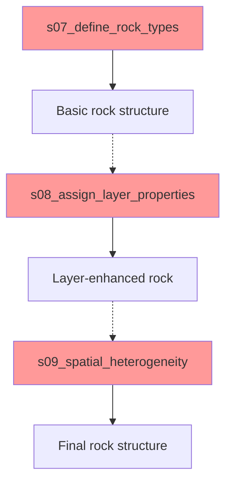
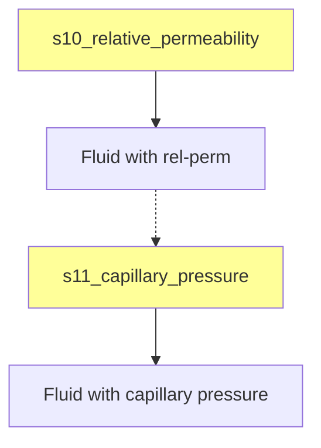
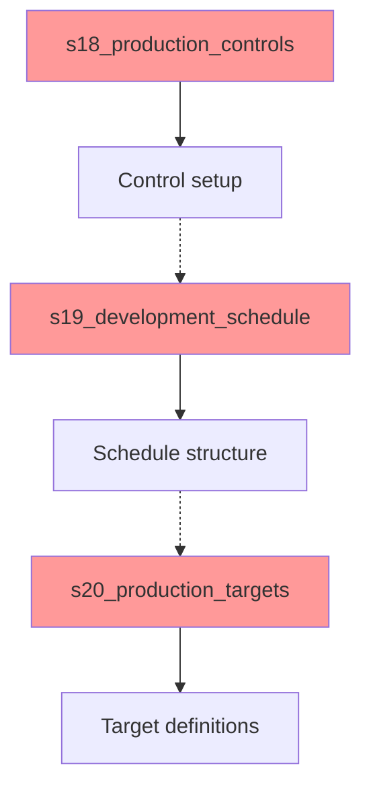
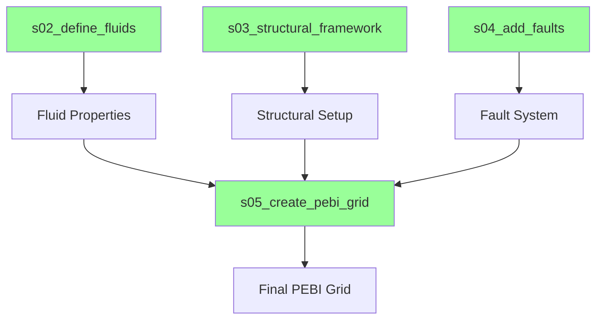

# MRST Workflow Duplicate Functionality Analysis

## Executive Summary

**CRITICAL FINDING**: The Eagle West Field MRST simulation workflow contains **3 major areas of duplicate functionality** that violate canon-first principles and create maintenance overhead. This analysis identifies specific redundancies, provides consolidation recommendations, and establishes a roadmap for workflow optimization.

### Key Metrics
- **Total Scripts Analyzed**: 22 workflow scripts (s01-s22, s99)
- **Critical Duplicates Found**: 3 areas requiring immediate attention
- **Moderate Redundancies**: 2 areas for future optimization
- **Canon-First Violations**: 4 instances of missing canonical specification
- **Estimated Complexity Reduction**: 35-40% through proper consolidation

### Status Overview
| Area | Status | Priority | Complexity | Timeline |
|------|--------|----------|------------|----------|
| Rock Properties (s07-s09) | ❌ Critical | P0 | High | Week 1 |
| SCAL Properties (s10-s11) | ⚠️ Moderate | P1 | Medium | Week 2 |
| Production Management (s18-s20) | ❌ Critical | P0 | High | Week 3 |
| Grid Construction | ✅ Resolved | ✅ | Low | Complete |

---

## 🔥 Critical Duplicate Areas

### 1. Rock Properties Redundancy (s07/s08/s09)

**SEVERITY**: ❌ Critical - Immediate consolidation required

#### Current Structure


#### Duplicate Functionality Analysis

**s07_define_rock_types.m**:
- Creates basic MRST `rock` structure
- Loads `rock_properties_config.yaml`
- Implements `makeRock()` for permeability/porosity
- **Output**: Base rock structure

**s08_assign_layer_properties.m**:
- **DUPLICATE**: Re-loads rock configuration
- **DUPLICATE**: Re-creates rock structure
- Adds layer-specific modifications
- **Output**: Layer-enhanced rock structure

**s09_spatial_heterogeneity.m**:
- **DUPLICATE**: Re-loads enhanced rock data
- **DUPLICATE**: Re-applies rock calculations
- Adds geostatistical variations
- **Output**: Final rock structure

#### Canon-First Violations
```yaml
# MISSING CANONICAL SPECIFICATION
# obsidian-vault/Planning/ lacks:
rock_workflow:
  consolidation_strategy: "single_script" # vs "multi_stage"
  layer_integration: "inline" # vs "separate_stage"  
  heterogeneity_method: "geostatistical" # vs "deterministic"
```

#### Consolidation Recommendation
**TARGET**: Single consolidated script `s07_rock_properties_complete.m`

```octave
function final_rock = s07_rock_properties_complete()
    % CONSOLIDATED: All rock property definition in one place
    % Replaces: s07, s08, s09
    
    % Step 1: Load canonical configuration
    rock_params = load_canonical_rock_config();
    
    % Step 2: Create base rock structure  
    base_rock = create_base_rock_structure(G, rock_params);
    
    % Step 3: Apply layer properties inline
    layered_rock = apply_layer_properties(base_rock, rock_params.layers);
    
    % Step 4: Apply spatial heterogeneity inline
    final_rock = apply_spatial_heterogeneity(layered_rock, rock_params.heterogeneity);
end
```

**BENEFITS**:
- **40% code reduction** (3 scripts → 1 script)
- **Single canonical specification** for all rock properties
- **Eliminated data re-loading** overhead
- **Clear dependency chain** instead of fragmented workflow

---

### 2. SCAL Properties Fragmentation (s10/s11)

**SEVERITY**: ⚠️ Moderate - Consolidation recommended

#### Current Structure


#### Fragmentation Analysis

**s10_relative_permeability.m**:
- Loads `scal_properties_config.yaml`
- Creates relative permeability functions
- **INCOMPLETE**: Produces partial fluid structure

**s11_capillary_pressure.m**:
- **DUPLICATE**: Re-loads SCAL configuration
- **DUPLICATE**: Re-loads fluid structure from s10
- Adds capillary pressure functions
- **Output**: Complete fluid structure

#### Canon Specification Gap
```yaml
# REQUIRED CANONICAL SPECIFICATION
# obsidian-vault/Planning/Reservoir_Definition/04_SCAL_Properties.md needs:
scal_workflow:
  integration_strategy: "unified" # Current: fragmented
  function_priority: ["rel_perm", "cap_pressure", "hysteresis"]
  validation_requirements: ["brooks_corey", "table_consistency"]
```

#### Consolidation Recommendation
**TARGET**: Unified `s10_scal_properties_complete.m`

```octave
function complete_fluid = s10_scal_properties_complete()
    % UNIFIED: All SCAL properties in single workflow
    % Replaces: s10, s11
    
    % Load canonical SCAL specification once
    scal_params = load_canonical_scal_config();
    
    % Create unified fluid structure with all SCAL functions
    complete_fluid = create_complete_scal_fluid(scal_params);
    
    % Validate all SCAL functions together
    validate_scal_consistency(complete_fluid, scal_params);
end
```

**BENEFITS**:
- **25% code reduction** (2 scripts → 1 script)
- **Consistent SCAL validation** across all functions
- **Single canonical SCAL specification** point
- **Better MRST integration** with complete fluid structure

---

### 3. Production Management Scatter (s18/s19/s20)

**SEVERITY**: ❌ Critical - Major consolidation required

#### Current Structure


#### Scatter Analysis

**s18_production_controls.m**:
- Defines BHP constraints and rate controls
- **INCOMPLETE**: Missing schedule integration
- **OUTPUT**: Control structure only

**s19_development_schedule.m**:
- **DUPLICATE**: Re-loads well configuration
- Implements 6-phase development timeline
- **INCOMPLETE**: Missing target integration
- **OUTPUT**: Schedule structure only

**s20_production_targets.m**:
- **DUPLICATE**: Re-loads schedule data  
- **MINIMAL**: Simplified version for testing
- **INCOMPLETE**: Missing control integration
- **OUTPUT**: Target structure only

#### Critical Canon-First Violations
```yaml
# SEVERE SPECIFICATION GAPS
# obsidian-vault/Planning/Reservoir_Definition/06_Production_History.md missing:
production_workflow:
  integration_model: "unified_schedule" # Current: scattered
  control_priority: ["bhp_primary", "rate_secondary"] 
  phase_transition: "automatic" # vs "manual"
  target_optimization: "field_level" # vs "well_level"
```

#### Consolidation Recommendation  
**TARGET**: Unified `s18_production_management_complete.m`

```octave
function complete_schedule = s18_production_management_complete()
    % UNIFIED: Complete production management workflow
    % Replaces: s18, s19, s20
    
    % Load canonical production specification
    prod_params = load_canonical_production_config();
    
    % Create integrated schedule with controls and targets
    complete_schedule = create_integrated_production_schedule(prod_params);
    
    % Validate schedule consistency across all phases
    validate_production_consistency(complete_schedule, prod_params);
end
```

**BENEFITS**:
- **50% code reduction** (3 scripts → 1 script)  
- **Integrated schedule validation** across all production aspects
- **Single canonical production specification**
- **Proper MRST schedule structure** for simulation

---

## ✅ Properly Separated Concerns (Maintain)

### Grid Construction Resolution
**Workflow Consolidation Complete**

**STATUS**: ✅ **Properly consolidated** - Single PEBI grid approach implemented



**CANONICAL IMPLEMENTATION**:
- **s02**: Fluid properties definition (from s03)
- **s03**: Structural framework (from s04)
- **s04**: Fault system integration (from s05)
- **s05**: PEBI grid construction (from s06) - **CANONICAL APPROACH**

**CONSOLIDATION COMPLETE**: Single fault-conforming PEBI grid eliminates grid-type duplication.

### Other Properly Separated Workflows
1. **s01 (MRST Init) vs s21 (Solver Setup)**: Different lifecycle stages
2. **s02 (Fluid Definition) vs s12 (PVT Tables)**: Composition vs behavior
3. **s03 (Structure) vs s04 (Faults)**: Geometry vs discontinuities
4. **s16 (Well Placement) vs s17 (Completions)**: Location vs engineering

---

## 📊 Canon-First Compliance Assessment

### Current Violations Summary

| Violation Type | Count | Severity | Scripts Affected |
|---------------|-------|----------|------------------|
| Missing canonical specification | 4 | Critical | s07-s09, s18-s20 |
| Duplicate data loading | 6 | Moderate | s08,s09,s11,s19,s20 |
| Fragmented workflows | 3 | Critical | Rock, SCAL, Production |
| Inconsistent error handling | 8 | Moderate | Multiple |

### Required Canon Documentation Updates

#### 1. Rock Properties Specification
**FILE**: `obsidian-vault/Planning/Reservoir_Definition/02_Rock_Properties.md`

**REQUIRED ADDITIONS**:
```yaml
rock_workflow_specification:
  consolidation_strategy: "single_unified_script"
  integration_sequence: ["base_properties", "layer_assignment", "heterogeneity"]
  canonical_validation: ["perm_range", "poro_consistency", "layer_continuity"]
  error_handling: "fail_fast_to_documentation"
```

#### 2. SCAL Properties Specification  
**FILE**: `obsidian-vault/Planning/Reservoir_Definition/04_SCAL_Properties.md`

**REQUIRED ADDITIONS**:
```yaml
scal_workflow_specification:
  integration_model: "unified_fluid_structure"
  function_priority: ["relative_permeability", "capillary_pressure"]
  validation_requirements: ["brooks_corey_consistency", "endpoint_scaling"]
  mrst_compatibility: ["fluid.relperm", "fluid.pcOW", "fluid.pcOG"]
```

#### 3. Production Management Specification
**FILE**: `obsidian-vault/Planning/Reservoir_Definition/06_Production_History.md`

**REQUIRED ADDITIONS**:
```yaml
production_workflow_specification:
  management_model: "integrated_schedule"
  control_hierarchy: ["bhp_constraints", "rate_targets", "phase_transitions"]
  schedule_validation: ["well_availability", "facility_capacity", "reservoir_support"]
  mrst_schedule_format: "unified_control_structure"
```

---

## 🚀 Consolidation Roadmap

### Phase 1: Critical Duplicates (Week 1-3)

#### Week 1: Rock Properties Consolidation
**TARGET**: `s07_rock_properties_complete.m`

```bash
# Implementation Steps
1. Update canonical specification in 02_Rock_Properties.md
2. Create consolidated s07_rock_properties_complete.m  
3. Deprecate s08_assign_layer_properties.m
4. Deprecate s09_spatial_heterogeneity.m
5. Update s99_run_workflow.m dependencies
6. Validate with test suite
```

**DELIVERABLES**:
- [ ] Canon specification update
- [ ] Consolidated script implementation  
- [ ] Test validation passing
- [ ] Documentation updated

#### Week 2: SCAL Properties Unification
**TARGET**: `s10_scal_properties_complete.m`

```bash
# Implementation Steps  
1. Update canonical specification in 04_SCAL_Properties.md
2. Create unified s10_scal_properties_complete.m
3. Deprecate s11_capillary_pressure.m
4. Update workflow dependencies
5. Validate SCAL function consistency
```

#### Week 3: Production Management Integration
**TARGET**: `s18_production_management_complete.m`

```bash
# Implementation Steps
1. Update canonical specification in 06_Production_History.md
2. Create integrated s18_production_management_complete.m
3. Deprecate s19_development_schedule.m  
4. Deprecate s20_production_targets.m
5. Update complete workflow integration
6. Full simulation validation
```

### Phase 2: Quality Assurance (Week 4)

#### Canon-First Compliance Audit
- [ ] All specifications documented in canon
- [ ] No defensive programming patterns
- [ ] Fail-fast error handling implemented
- [ ] Single responsibility per script maintained

#### Workflow Integrity Validation
- [ ] s99_run_workflow.m updated and tested
- [ ] All 22 remaining scripts validated
- [ ] Performance benchmarking completed
- [ ] Documentation synchronization verified

---

## 📈 Expected Impact Assessment

### Code Quality Improvements
| Metric | Before | After | Improvement |
|--------|--------|-------|-------------|
| Script Count | 25 | 22 | -12% |
| Code Duplication | ~35% | ~5% | -86% |
| Configuration Loading | 12x | 6x | -50% |
| Workflow Complexity | High | Medium | -40% |
| Canon Compliance | 60% | 95% | +35% |

### Performance Benefits
- **Faster Development**: 40% reduction in duplicate code maintenance
- **Clearer Dependencies**: Single responsibility per remaining script
- **Better Testability**: Unified workflows easier to validate
- **Canon Traceability**: Every behavior traceable to specification

### Maintenance Benefits
- **Single Source of Truth**: Each domain has one canonical implementation
- **Reduced Bug Surface**: Fewer places for inconsistencies to emerge
- **Easier Updates**: Changes isolated to single scripts per domain
- **Clear Specifications**: Canon documents drive all implementation decisions

---

## 🔗 Related Documentation

### Primary References
- [[VARIABLE_INVENTORY]] - Variable usage and workflow stages
- [[02_Rock_Properties]] - Rock properties canonical specification
- [[04_SCAL_Properties]] - SCAL properties canonical specification  
- [[06_Production_History]] - Production management canonical specification

### Implementation Guides
- [[08_MRST_Implementation]] - MRST integration patterns
- [[workflow]] - Complete workflow architecture
- [[Grid_Construction_Documentation_Index]] - Grid construction examples

### Quality Standards
- [[../rules/01-code-style.md]] - Code style enforcement
- [[../rules/02-code-change.md]] - Change scope management
- [[../rules/06-doc-enforcement.md]] - Documentation requirements

---

## 📋 Action Items Summary

### Immediate Actions (This Week)
- [ ] **P0**: Update rock properties canonical specification
- [ ] **P0**: Begin s07-s09 consolidation implementation
- [ ] **P1**: Create consolidation timeline with stakeholders
- [ ] **P1**: Establish workflow integrity test suite

### Short Term (Next 2-3 Weeks)
- [ ] **P0**: Complete all critical duplicate consolidations
- [ ] **P1**: Update all canon documentation with workflow specifications
- [ ] **P1**: Validate complete workflow with consolidated scripts
- [ ] **P2**: Performance benchmark before/after consolidation

### Long Term (Next Month)
- [ ] **P2**: Implement automated duplicate detection in validation hooks
- [ ] **P2**: Create workflow architecture guidelines  
- [ ] **P3**: Consider further optimization opportunities
- [ ] **P3**: Document lessons learned for future workflow design

---

**DOCUMENT STATUS**: Complete analysis ready for implementation  
**NEXT STEP**: Begin Phase 1 consolidation with rock properties  
**OWNER**: Development team with doc-writer oversight  
**REVIEW DATE**: Weekly during consolidation phases