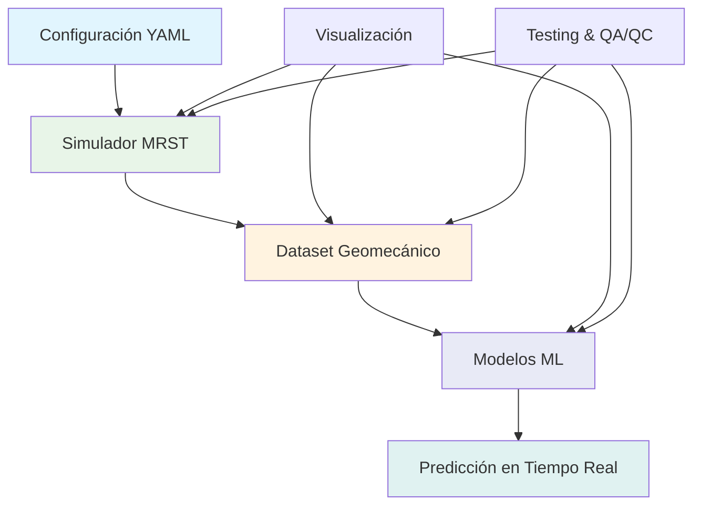
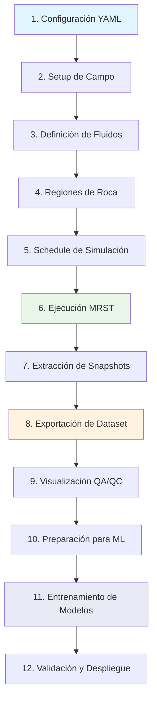

# Capítulo 1: Introducción al Sistema

## 1.1 ¿Qué es GeomechML?

GeomechML es un sistema integrado que combina simulaciones de yacimientos petroleros con modelos de machine learning para crear **modelos sustitutos** (surrogate models) de procesos geomecánicos. El sistema está diseñado para generar datasets sintéticos de alta calidad que permiten entrenar modelos de aprendizaje automático capaces de predecir la evolución de propiedades geomecánicas en tiempo real.

### Problema que Resuelve

Las simulaciones geomecánicas tradicionales son:
- ⏱️ **Computacionalmente costosas** - Requieren horas o días de cálculo
- 🔧 **Complejas de configurar** - Necesitan expertise técnico especializado
- 📊 **Limitadas en tiempo real** - No permiten análisis interactivo

GeomechML soluciona estos problemas mediante:
- 🚀 **Predicción en tiempo real** - Modelos ML que predicen en milisegundos
- 🎯 **Configuración simplificada** - Sistema YAML intuitivo
- 📈 **Análisis interactivo** - Visualización y análisis inmediatos

## 1.2 Arquitectura General del Sistema

### Visión de Alto Nivel



### Componentes Principales

#### 1. **Simulador de Yacimientos (MRST)**
- **Tecnología**: Octave + MRST (MATLAB Reservoir Simulation Toolbox)
- **Función**: Simular flujo de fluidos y compactación geomecánica
- **Salida**: Estados de simulación con propiedades espaciotemporales

#### 2. **Sistema de Extracción de Datos**
- **Tecnología**: Octave + formato MAT
- **Función**: Convertir simulaciones en datasets para ML
- **Salida**: Matrices 20x20 de propiedades geomecánicas

#### 3. **Modelos de Machine Learning**
- **Tecnología**: Python + TensorFlow/PyTorch
- **Función**: Entrenar modelos sustitutos
- **Salida**: Modelos capaces de predicción en tiempo real

#### 4. **Sistema de Visualización y QA/QC**
- **Tecnología**: Octave + matplotlib
- **Función**: Análisis visual y control de calidad
- **Salida**: Reportes automáticos y dashboards

## 1.3 Flujo de Trabajo del Sistema

### Proceso Completo



### Fases del Proyecto

#### **Fase 1: Generación de Datos** (Capítulos 2-6)
- Configuración del sistema
- Ejecución de simulaciones MRST
- Extracción y validación de datasets
- Control de calidad automático

#### **Fase 2: Machine Learning** (Capítulos 7-9)
- Preparación de datos para ML
- Entrenamiento de modelos sustitutos
- Validación y optimización
- Implementación en producción

#### **Fase 3: Aplicación** (Capítulos 10-11)
- Casos de uso prácticos
- Análisis de resultados
- Optimización de rendimiento
- Soporte y mantenimiento

## 1.4 Tecnologías Utilizadas

### Stack Tecnológico

| Componente | Tecnología | Versión | Propósito |
|-----------|------------|---------|-----------|
| **Simulación** | Octave | 6.0+ | Ejecución de MRST |
| **MRST** | MATLAB Toolbox | 2023a+ | Simulación de yacimientos |
| **ML Framework** | Python | 3.8+ | Modelos de aprendizaje |
| **Configuración** | YAML | 1.2 | Parámetros del sistema |
| **Visualización** | Octave/Python | - | Análisis y reportes |
| **Testing** | Octave | - | Pruebas automatizadas |

### Dependencias Principales

#### MRST (Octave)
```octave
% Módulos MRST requeridos
mrstModule add ad-core ad-blackoil ad-props
mrstModule add incomp mrst-gui
```

#### Python (Machine Learning)
```python
# Librerías Python requeridas
numpy>=1.20.0
scipy>=1.7.0
matplotlib>=3.4.0
scikit-learn>=1.0.0
tensorflow>=2.8.0  # o pytorch>=1.11.0
```

## 1.5 Casos de Uso Principales

### 1. **Predicción de Compactación**
- **Objetivo**: Predecir cambios en porosidad por compactación
- **Entrada**: Presión de poro, propiedades iniciales
- **Salida**: Evolución temporal de porosidad

### 2. **Optimización de Pozos**
- **Objetivo**: Optimizar ubicación y controles de pozos
- **Entrada**: Configuración de pozos, propiedades del yacimiento
- **Salida**: Configuración óptima de producción

### 3. **Análisis de Riesgo**
- **Objetivo**: Evaluar riesgo de subsidencia
- **Entrada**: Parámetros geomecánicos, escenarios de producción
- **Salida**: Mapas de riesgo y probabilidades

### 4. **Monitoreo en Tiempo Real**
- **Objetivo**: Monitorear condiciones del yacimiento
- **Entrada**: Datos de pozos en tiempo real
- **Salida**: Estado actual y predicciones futuras

## 1.6 Ventajas del Sistema

### **Velocidad**
- ⚡ **1000x más rápido** que simulaciones tradicionales
- 📊 **Análisis interactivo** en tiempo real
- 🔄 **Múltiples escenarios** en minutos

### **Precisión**
- 🎯 **Validado con MRST** - Datos de referencia confiables
- 📈 **Métricas de calidad** - R² > 0.95 típicamente
- 🔍 **Control de calidad** automático

### **Flexibilidad**
- 🔧 **Configuración YAML** - Fácil modificación de parámetros
- 📦 **Modular** - Componentes independientes
- 🚀 **Escalable** - Desde casos simples hasta complejos

### **Reproducibilidad**
- 📋 **Documentación completa** - Cada paso documentado
- 🧪 **Tests automatizados** - Validación continua
- 📊 **Metadata completa** - Trazabilidad total

## 1.7 Limitaciones y Consideraciones

### **Limitaciones Actuales**
- 🔲 **2D únicamente** - Grid cartesiano 20x20
- 🌊 **Flujo incompresible** - Modelo simplificado
- 📊 **Litologías limitadas** - 3 tipos de roca
- ⏱️ **Tiempo fijo** - 365 días de simulación

### **Consideraciones Técnicas**
- 💾 **Memoria** - Requiere ~2GB RAM para simulación completa
- 🖥️ **CPU** - Simulación toma ~5-10 minutos en CPU moderna
- 📦 **Almacenamiento** - Dataset completo ~50MB
- 🔧 **Expertise** - Conocimiento básico de MRST recomendado

## 1.8 Próximos Pasos

Después de leer este capítulo, deberías entender:
- ✅ **Qué es GeomechML** y qué problema resuelve
- ✅ **Arquitectura general** del sistema
- ✅ **Flujo de trabajo** completo
- ✅ **Tecnologías involucradas**
- ✅ **Casos de uso** principales

### **Continúa con:**
- 📖 **[Capítulo 2: Configuración Inicial](02_configuracion_inicial.md)** - Configurar tu entorno
- 🔧 **Instalación de MRST** y dependencias
- 📁 **Estructura del proyecto** y organización de archivos

### **Referencias Técnicas**
- 📚 **MRST Documentation**: https://www.sintef.no/mrst
- 🐍 **Python ML Libraries**: scikit-learn, tensorflow, pytorch
- 📝 **YAML Specification**: https://yaml.org/spec/

---

*[⬅️ Volver al Índice](README.md) | [Siguiente: Configuración Inicial ➡️](02_configuracion_inicial.md)* 