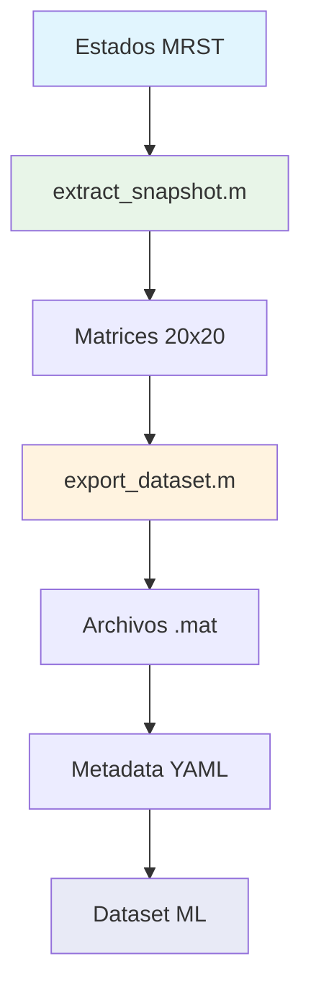

# Capítulo 5: Extracción de Datos

## 5.1 Introducción

En este capítulo aprenderás a extraer y procesar los datos de simulación para crear datasets listos para machine learning. Este es el puente crítico entre la simulación física y los modelos de aprendizaje automático.

### **Objetivos del Capítulo**
- ✅ Extraer snapshots de estados MRST
- ✅ Convertir datos a formato ML
- ✅ Generar metadata completa
- ✅ Validar integridad de datasets
- ✅ Preparar datos para entrenamiento

## 5.2 Sistema de Extracción de Datos

El sistema de extracción de datos convierte las salidas de simulación MRST en datasets estructurados para entrenamiento de modelos de machine learning. Este proceso incluye la transformación de datos, normalización y generación de metadata.

## Arquitectura de Extracción

### Workflow de Extracción



### Módulos Principales

1. **`extract_snapshot.m`** - Extracción de snapshots individuales
2. **`export_dataset.m`** - Exportación masiva de datasets
3. **Metadata generation** - Documentación automática

## Extracción de Snapshots

### Función `extract_snapshot.m`

Convierte un estado de simulación MRST en matrices 20x20 para ML:

```octave
[sigma_eff, phi, k, rock_id] = extract_snapshot(G, rock, state, timestep);
```

### Variables Extraídas

#### 1. Esfuerzo Efectivo (σ')
**Descripción**: Esfuerzo efectivo calculado usando la ley de Terzaghi
**Unidades**: psi
**Rango típico**: 1800-2500 psi

**Cálculo**:
```octave
% Ley de Terzaghi: σ' = σ_total - p_pore
depth = G.cells.centroids(:,3);          % Profundidad [ft]
sigma_total = overburden_gradient * depth; % Esfuerzo total [psi]
p_pore = state.pressure;                  % Presión de poro [psi]
sigma_eff = sigma_total - p_pore;         % Esfuerzo efectivo [psi]
```

**Significado Físico**:
- Controla la compactación de la roca
- Determina cambios en porosidad
- Influye en la permeabilidad

#### 2. Porosidad (φ)
**Descripción**: Porosidad actual (evolucionada por compactación)
**Unidades**: Adimensional
**Rango típico**: 0.05-0.35

**Evolución**:
```octave
% Modelo de compactación lineal
phi_current = phi_initial .* (1 - c_phi * delta_sigma_eff);
```

**Características**:
- Disminuye con el tiempo debido a compactación
- Heterogeneidad espacial preservada
- Correlacionada con permeabilidad

#### 3. Permeabilidad (k)
**Descripción**: Permeabilidad actual (evolucionada por compactación)
**Unidades**: mD
**Rango típico**: 1-500 mD

**Evolución**:
```octave
% Relación Kozeny-Carman
k_current = k_initial .* (phi_current ./ phi_initial).^n_exp;
```

**Parámetros por Región**:
- **Región 1**: n_exp = 8 (tight rock)
- **Región 2**: n_exp = 6 (medium rock)
- **Región 3**: n_exp = 4 (loose rock)

#### 4. Región de Roca (rock_id)
**Descripción**: Identificador de litología
**Unidades**: Adimensional (1, 2, 3)
**Distribución**: Basada en porosidad inicial

**Clasificación**:
```octave
rock_id = ones(nx, ny);
rock_id(phi_initial >= 0.18 & phi_initial < 0.22) = 2;
rock_id(phi_initial >= 0.22) = 3;
```

## Exportación de Dataset

### Función `export_dataset.m`

Exporta todos los timesteps de simulación a archivos .mat:

```octave
export_dataset(G, rock, states, wellSols, config);
```

### Estructura de Archivos

#### Snapshots Individuales
```
data/raw/
├── snap_001.mat    # Timestep 1
├── snap_002.mat    # Timestep 2
├── ...
└── snap_050.mat    # Timestep 50
```

#### Contenido de cada Snapshot
```matlab
% Estructura de snap_XXX.mat
snapshot = struct();
snapshot.sigma_eff = [20x20 double];  % Esfuerzo efectivo [psi]
snapshot.phi = [20x20 double];        % Porosidad [-]
snapshot.k = [20x20 double];          % Permeabilidad [mD]
snapshot.rock_id = [20x20 double];    % Región de roca [-]
snapshot.timestamp = 15;              % Número de timestep
snapshot.time_days = 109.5;           % Tiempo en días
snapshot.pressure_avg = 2456.3;       % Presión promedio [psi]
snapshot.phi_avg = 0.187;             % Porosidad promedio [-]
snapshot.k_avg = 87.4;                % Permeabilidad promedio [mD]
```

#### Metadata Completa
```
data/raw/
├── metadata.mat     # Metadata binaria
└── metadata.yaml    # Metadata legible
```

### Contenido de Metadata

#### `metadata.yaml`
```yaml
dataset_info:
  name: "MRST Geomechanical Simulation"
  description: "Flow-compaction simulation results"
  creation_date: "2024-07-06T19:30:45"
  n_snapshots: 50
  total_size_mb: 1.1

simulation:
  total_time_days: 365.0
  n_timesteps: 50
  timestep_days: [7.3, 7.3, 7.3, ...]  # Array de timesteps
  n_wells: 2
  
grid:
  dimensions: [20, 20]
  cell_size_ft: [164, 164]
  total_cells: 400
  area_km2: 1.0

rock:
  n_regions: 3
  porosity_range: [0.050, 0.350]
  permeability_range_mD: [10.0, 500.0]
  region_distribution:
    region_1: 0.33  # Fracción de celdas
    region_2: 0.34
    region_3: 0.33

wells:
  producer:
    location: [15, 10]
    bhp_psi: 2175
    
  injector:
    location: [5, 10]
    rate_bbl_day: 251

statistics:
  sigma_eff:
    initial_avg: 2234.5
    final_avg: 2187.3
    min_value: 1856.2
    max_value: 2498.7
    
  porosity:
    initial_avg: 0.200
    final_avg: 0.187
    min_value: 0.052
    max_value: 0.347
    
  permeability:
    initial_avg: 100.0
    final_avg: 87.4
    min_value: 1.2
    max_value: 487.3
```

#### `metadata.mat`
```matlab
% Contenido de metadata.mat
metadata = struct();
metadata.config = config;           % Configuración original
metadata.G = G;                     % Grid MRST
metadata.rock_initial = rock_init;  % Propiedades iniciales
metadata.wellSols = wellSols;       % Soluciones de pozos
metadata.timestamps = [1:50];       % Array de timesteps
metadata.time_days = time_vector;   % Tiempo en días
metadata.statistics = stats;        % Estadísticas calculadas
```

## Procesamiento de Datos

### Normalización

Para ML, se recomienda normalizar los datos:

```octave
% Normalización por variable
sigma_eff_norm = (sigma_eff - mean(sigma_eff(:))) / std(sigma_eff(:));
phi_norm = (phi - 0.2) / 0.05;  % Centrado en valor base
k_norm = log10(k / 100);         % Escala logarítmica
```

### Formato para ML

#### Matrices de Entrada (X)
```octave
% Concatenar todas las variables en tensor 4D
X = cat(4, sigma_eff_norm, phi_norm, k_norm, rock_id);
% Dimensiones: [20, 20, 1, 4] por snapshot
```

#### Matrices de Salida (Y)
```octave
% Para predicción temporal
Y = X_next_timestep;  % Mismo formato que X
```

### Validación de Datos

#### Checks de Consistencia
```octave
% Verificar rangos físicos
assert(all(phi(:) >= 0.01 & phi(:) <= 0.5), 'Porosity out of range');
assert(all(k(:) >= 0.1 & k(:) <= 1000), 'Permeability out of range');
assert(all(sigma_eff(:) >= 1000), 'Negative effective stress');

% Verificar evolución temporal
delta_phi = phi_final - phi_initial;
assert(all(delta_phi(:) <= 0), 'Porosity increased (unphysical)');
```

#### Estadísticas de Calidad
```octave
% Calcular métricas de calidad
cv_phi = std(phi(:)) / mean(phi(:));      % Coeficiente de variación
correlation_k_phi = corr(k(:), phi(:));   % Correlación k-φ
mass_balance_error = abs(sum(delta_phi(:))); % Error de balance
```

## Uso del Dataset

### Cargar Datos en Python

```python
import scipy.io
import numpy as np

# Cargar snapshot individual
data = scipy.io.loadmat('data/raw/snap_001.mat')
sigma_eff = data['snapshot']['sigma_eff'][0,0]
phi = data['snapshot']['phi'][0,0]
k = data['snapshot']['k'][0,0]
rock_id = data['snapshot']['rock_id'][0,0]

# Cargar metadata
metadata = scipy.io.loadmat('data/raw/metadata.mat')
config = metadata['metadata']['config'][0,0]
```

### Cargar Dataset Completo

```python
# Función para cargar dataset completo
def load_geomech_dataset(data_dir='data/raw/'):
    snapshots = []
    for i in range(1, 51):
        filename = f'snap_{i:03d}.mat'
        data = scipy.io.loadmat(f'{data_dir}/{filename}')
        snapshot = data['snapshot']
        snapshots.append(snapshot)
    
    return np.array(snapshots)
```

### Preparar para Entrenamiento

```python
# Preparar datos para CNN
X = np.stack([s['sigma_eff'] for s in snapshots])  # [50, 20, 20]
X = X.reshape(-1, 20, 20, 1)  # [50, 20, 20, 1]

# Preparar secuencias temporales
X_sequence = X[:-1]  # Timesteps 1-49
Y_sequence = X[1:]   # Timesteps 2-50
```

## Troubleshooting

### Problemas Comunes

1. **Archivos .mat corruptos**
   - Verificar espacio en disco
   - Revisar permisos de escritura
   - Confirmar versión de Octave

2. **Valores NaN en datos**
   - Verificar convergencia de simulación
   - Revisar condiciones iniciales
   - Confirmar estabilidad numérica

3. **Inconsistencias temporales**
   - Verificar orden de timesteps
   - Confirmar evolución física
   - Revisar cálculos de tiempo

### Scripts de Validación

```octave
% Script de validación completa
function validate_dataset(data_dir)
    files = dir(fullfile(data_dir, 'snap_*.mat'));
    
    for i = 1:length(files)
        data = load(fullfile(data_dir, files(i).name));
        snapshot = data.snapshot;
        
        % Verificar estructura
        assert(isfield(snapshot, 'sigma_eff'), 'Missing sigma_eff');
        assert(isfield(snapshot, 'phi'), 'Missing phi');
        assert(isfield(snapshot, 'k'), 'Missing k');
        assert(isfield(snapshot, 'rock_id'), 'Missing rock_id');
        
        % Verificar dimensiones
        assert(all(size(snapshot.sigma_eff) == [20, 20]), 'Wrong dimensions');
        
        % Verificar rangos
        assert(all(snapshot.phi(:) >= 0.01), 'Invalid porosity');
        assert(all(snapshot.k(:) >= 0.1), 'Invalid permeability');
        
        fprintf('Snapshot %d validated\n', i);
    end
    
    fprintf('All snapshots validated successfully\n');
end
```

## 5.12 Próximos Pasos

### **Verificación Final**

Antes de continuar, asegúrate de que:
- ✅ Tienes 50 archivos snap_XXX.mat
- ✅ Los datos están en rangos físicos válidos
- ✅ La metadata es completa y precisa
- ✅ Puedes cargar datos en Python sin errores

### **¿Qué Sigue?**

Ahora que tienes un dataset completo, estás listo para:

📖 **[Capítulo 6: Visualización y QA/QC](06_visualizacion_qaqc.md)**
- Crear visualizaciones de tus datos
- Realizar control de calidad automático
- Generar reportes de validación
- Detectar anomalías en los datos

### **Dataset Generado**

Después de este capítulo deberías tener:
- 📊 **50 snapshots** de simulación (1.1 MB total)
- 📋 **Metadata completa** en YAML y MAT
- 🔍 **Datos validados** y listos para ML
- 📈 **Estadísticas** de calidad de datos

---

*[⬅️ Capítulo 4: Simulación de Yacimientos](04_simulacion_yacimientos.md) | [Siguiente: Visualización y QA/QC ➡️](06_visualizacion_qaqc.md)*

*Fuente: `MRST_simulation_scripts/extract_snapshot.m` y `MRST_simulation_scripts/export_dataset.m`* 