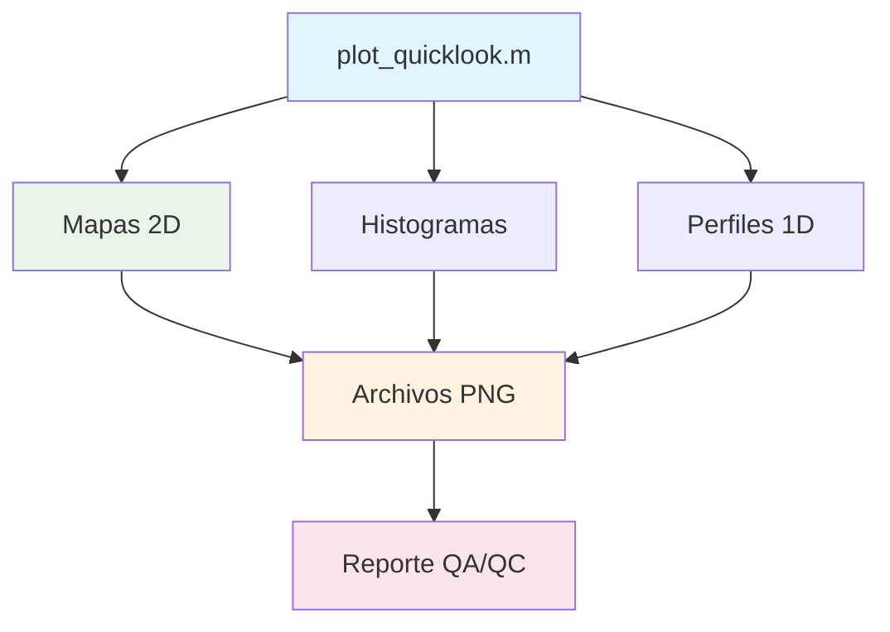

# Visualización y QA/QC

## Descripción General

El sistema de visualización de GeomechML proporciona herramientas para análisis visual de resultados de simulación, control de calidad (QA/QC) y generación de reportes gráficos para validación de datos.

## Arquitectura de Visualización

### Módulos de Visualización



### Componentes Principales

1. **`plot_quicklook.m`** - Visualización rápida de snapshots
2. **Mapas 2D** - Distribuciones espaciales de propiedades
3. **Análisis estadístico** - Histogramas y estadísticas
4. **Evolución temporal** - Trends de propiedades

## Función Principal: `plot_quicklook.m`

### Propósito

Crear visualizaciones rápidas de resultados de simulación para:
- Validación de heterogeneidad espacial
- Verificación de estabilidad numérica
- Control de calidad de datos
- Análisis de evolución temporal

### Uso

```octave
% Visualizar timestep específico
plot_quicklook(G, rock, states, timestep_idx);

% Visualizar estado inicial
plot_quicklook(G, rock, states, 1);

% Visualizar estado final
plot_quicklook(G, rock, states, length(states));
```

### Parámetros

- **G**: Estructura de grid MRST
- **rock**: Propiedades de roca
- **states**: Array de estados de simulación
- **timestep_idx**: Índice del timestep a visualizar (opcional)

## Tipos de Visualización

### 1. Mapas 2D de Propiedades

#### Esfuerzo Efectivo (σ')
```octave
% Mapa de esfuerzo efectivo
subplot(2,2,1);
imagesc(sigma_eff);
colorbar;
title('Esfuerzo Efectivo [psi]');
xlabel('X [celdas]');
ylabel('Y [celdas]');
```

**Características**:
- Rango típico: 1800-2500 psi
- Colormap: 'jet' para máximo contraste
- Contornos cada 50 psi
- Ubicación de pozos marcada

#### Porosidad (φ)
```octave
% Mapa de porosidad
subplot(2,2,2);
imagesc(phi);
colorbar;
title('Porosidad [-]');
xlabel('X [celdas]');
ylabel('Y [celdas]');
caxis([0.05 0.35]);  % Rango físico
```

**Características**:
- Rango fijo: 0.05-0.35
- Colormap: 'parula' para suavidad
- Heterogeneidad espacial visible
- Evolución temporal clara

#### Permeabilidad (k)
```octave
% Mapa de permeabilidad (escala logarítmica)
subplot(2,2,3);
imagesc(log10(k));
colorbar;
title('log_{10}(Permeabilidad [mD])');
xlabel('X [celdas]');
ylabel('Y [celdas]');
```

**Características**:
- Escala logarítmica para mejor visualización
- Rango: 1-500 mD
- Correlación con porosidad evidente
- Colormap: 'hot' para contraste

#### Regiones de Roca
```octave
% Mapa de regiones litológicas
subplot(2,2,4);
imagesc(rock_id);
colorbar;
title('Regiones de Roca');
xlabel('X [celdas]');
ylabel('Y [celdas]');
colormap(gca, 'lines');
```

**Características**:
- Valores discretos: 1, 2, 3
- Colormap categórico
- Distribución espacial de litologías
- Base para análisis geomecánico

### 2. Análisis Estadístico

#### Histogramas de Propiedades
```octave
% Histograma de porosidad
figure;
subplot(2,2,1);
histogram(phi(:), 20);
title('Distribución de Porosidad');
xlabel('Porosidad [-]');
ylabel('Frecuencia');
grid on;

% Estadísticas básicas
mean_phi = mean(phi(:));
std_phi = std(phi(:));
text(0.7, 0.8, sprintf('μ = %.3f\nσ = %.3f', mean_phi, std_phi), ...
     'Units', 'normalized');
```

#### Correlaciones Entre Variables
```octave
% Scatter plot k vs φ
figure;
scatter(phi(:), k(:), 'filled');
xlabel('Porosidad [-]');
ylabel('Permeabilidad [mD]');
title('Correlación k-φ');
grid on;

% Línea de regresión
p = polyfit(phi(:), k(:), 1);
hold on;
plot(phi(:), polyval(p, phi(:)), 'r-', 'LineWidth', 2);
```

### 3. Evolución Temporal

#### Trends de Propiedades Promedio
```octave
% Evolución temporal de porosidad promedio
time_days = [states.time] / day;  % Convertir a días
phi_avg = zeros(size(time_days));

for i = 1:length(states)
    [~, phi_snapshot, ~, ~] = extract_snapshot(G, rock, states(i), i);
    phi_avg(i) = mean(phi_snapshot(:));
end

figure;
plot(time_days, phi_avg, 'b-', 'LineWidth', 2);
xlabel('Tiempo [días]');
ylabel('Porosidad Promedio [-]');
title('Evolución Temporal de Porosidad');
grid on;
```

#### Mapas de Diferencia Temporal
```octave
% Diferencia entre estado final e inicial
[~, phi_initial, ~, ~] = extract_snapshot(G, rock, states(1), 1);
[~, phi_final, ~, ~] = extract_snapshot(G, rock, states(end), length(states));

delta_phi = phi_final - phi_initial;

figure;
imagesc(delta_phi);
colorbar;
title('Cambio en Porosidad (Final - Inicial)');
xlabel('X [celdas]');
ylabel('Y [celdas]');
colormap('RdBu');  % Azul-Blanco-Rojo
```

## Configuración de Plots

### Parámetros de Visualización

```octave
% Configuración estándar de figuras
set(0, 'DefaultFigurePosition', [100, 100, 1200, 800]);
set(0, 'DefaultAxesFontSize', 12);
set(0, 'DefaultTextFontSize', 12);
set(0, 'DefaultLineLineWidth', 1.5);
```

### Colormaps Recomendados

| Variable | Colormap | Razón |
|----------|----------|-------|
| Esfuerzo Efectivo | `jet` | Máximo contraste |
| Porosidad | `parula` | Suave, perceptualmente uniforme |
| Permeabilidad | `hot` | Enfatiza valores altos |
| Regiones de Roca | `lines` | Categórico, colores distintos |
| Diferencias | `RdBu` | Divergente, centrado en cero |

### Guardado de Figuras

```octave
% Guardar figura en alta resolución
function save_high_quality_figure(filename, fig_handle)
    if nargin < 2
        fig_handle = gcf;
    end
    
    % Configurar para alta calidad
    set(fig_handle, 'PaperPositionMode', 'auto');
    set(fig_handle, 'PaperUnits', 'inches');
    set(fig_handle, 'PaperSize', [12, 8]);
    
    % Guardar en múltiples formatos
    saveas(fig_handle, filename, 'png');
    saveas(fig_handle, filename, 'fig');
    
    % PDF para documentos
    print(fig_handle, '-dpdf', '-r300', [filename '.pdf']);
end
```

## QA/QC Automático

### Validación Visual Automática

```octave
function qa_qc_report(G, rock, states, output_dir)
    % Generar reporte QA/QC automático
    
    if ~exist(output_dir, 'dir')
        mkdir(output_dir);
    end
    
    % Análisis de timesteps clave
    key_timesteps = [1, round(length(states)/4), round(length(states)/2), length(states)];
    
    for i = 1:length(key_timesteps)
        timestep = key_timesteps(i);
        
        % Generar plots
        fig = figure('Visible', 'off');
        plot_quicklook(G, rock, states, timestep);
        
        % Guardar figura
        filename = sprintf('%s/snapshot_t%03d', output_dir, timestep);
        save_high_quality_figure(filename, fig);
        
        close(fig);
    end
    
    % Generar análisis estadístico
    generate_statistical_analysis(G, rock, states, output_dir);
    
    % Generar reporte HTML
    generate_html_report(output_dir);
end
```

### Detección de Anomalías

```octave
function anomalies = detect_anomalies(G, rock, states)
    % Detectar anomalías en datos de simulación
    
    anomalies = struct();
    
    for i = 1:length(states)
        [sigma_eff, phi, k, rock_id] = extract_snapshot(G, rock, states(i), i);
        
        % Detectar valores fuera de rango
        anomalies.negative_stress(i) = sum(sigma_eff(:) < 0);
        anomalies.invalid_porosity(i) = sum(phi(:) < 0.01 | phi(:) > 0.5);
        anomalies.invalid_permeability(i) = sum(k(:) < 0.1 | k(:) > 1000);
        
        % Detectar cambios abruptos
        if i > 1
            [~, phi_prev, ~, ~] = extract_snapshot(G, rock, states(i-1), i-1);
            delta_phi = abs(phi - phi_prev);
            anomalies.abrupt_changes(i) = sum(delta_phi(:) > 0.01);
        end
    end
    
    % Reportar anomalías
    total_anomalies = sum(struct2array(anomalies), 'all');
    if total_anomalies > 0
        warning('Detected %d anomalies in simulation data', total_anomalies);
    end
end
```

## Reportes Automáticos

### Generación de Reporte HTML

```octave
function generate_html_report(output_dir)
    % Generar reporte HTML con todas las figuras
    
    html_file = fullfile(output_dir, 'qa_qc_report.html');
    
    % Crear contenido HTML
    html_content = sprintf(['<!DOCTYPE html>\n' ...
        '<html>\n<head>\n' ...
        '<title>GeomechML QA/QC Report</title>\n' ...
        '<style>\n' ...
        'body { font-family: Arial, sans-serif; margin: 20px; }\n' ...
        'img { max-width: 800px; margin: 10px; }\n' ...
        'h1 { color: #333; }\n' ...
        'h2 { color: #666; }\n' ...
        '</style>\n' ...
        '</head>\n<body>\n']);
    
    html_content = [html_content sprintf('<h1>GeomechML Simulation QA/QC Report</h1>\n')];
    html_content = [html_content sprintf('<p>Generated on: %s</p>\n', datestr(now))];
    
    % Agregar imágenes
    png_files = dir(fullfile(output_dir, '*.png'));
    for i = 1:length(png_files)
        [~, name, ~] = fileparts(png_files(i).name);
        html_content = [html_content sprintf('<h2>%s</h2>\n', strrep(name, '_', ' '))];
        html_content = [html_content sprintf('\n', png_files(i).name, name)];
    end
    
    html_content = [html_content sprintf('</body>\n</html>')];
    
    % Escribir archivo HTML
    fid = fopen(html_file, 'w');
    fprintf(fid, '%s', html_content);
    fclose(fid);
    
    fprintf('HTML report generated: %s\n', html_file);
end
```

### Dashboard de Monitoreo

```octave
function create_monitoring_dashboard(G, rock, states)
    % Crear dashboard de monitoreo en tiempo real
    
    fig = figure('Name', 'GeomechML Monitoring Dashboard', ...
                 'Position', [100, 100, 1400, 1000]);
    
    % Layout de subplots
    subplot(2, 3, 1);
    plot_property_evolution(states, 'porosity');
    title('Evolución de Porosidad');
    
    subplot(2, 3, 2);
    plot_property_evolution(states, 'permeability');
    title('Evolución de Permeabilidad');
    
    subplot(2, 3, 3);
    plot_property_evolution(states, 'pressure');
    title('Evolución de Presión');
    
    subplot(2, 3, 4);
    plot_current_state(G, rock, states(end), 'porosity');
    title('Estado Actual - Porosidad');
    
    subplot(2, 3, 5);
    plot_current_state(G, rock, states(end), 'permeability');
    title('Estado Actual - Permeabilidad');
    
    subplot(2, 3, 6);
    plot_well_performance(states);
    title('Rendimiento de Pozos');
    
    % Actualizar cada 5 segundos (para simulación en tiempo real)
    timer_obj = timer('ExecutionMode', 'fixedRate', ...
                      'Period', 5, ...
                      'TimerFcn', @(~,~) update_dashboard(fig, G, rock, states));
    start(timer_obj);
end
```

## Mejores Prácticas

### Visualización Efectiva

1. **Colores Consistentes**: Usar la misma escala de colores para comparaciones
2. **Etiquetas Claras**: Incluir unidades en todos los ejes y títulos
3. **Resolución Adecuada**: Guardar figuras en alta resolución (300 DPI)
4. **Formato Estándar**: Usar tamaños de figura consistentes

### Control de Calidad

1. **Rangos Físicos**: Verificar que todas las propiedades estén en rangos realistas
2. **Continuidad Temporal**: Verificar evolución suave sin saltos abruptos
3. **Balance de Masa**: Verificar conservación de propiedades
4. **Correlaciones**: Verificar relaciones físicas esperadas (k-φ, σ'-φ)

### Automatización

1. **Scripts Batch**: Automatizar generación de múltiples figuras
2. **Reportes Programados**: Generar reportes automáticamente
3. **Detección de Anomalías**: Implementar alertas automáticas
4. **Archivado**: Organizar figuras por fecha y configuración

---

*Fuente: `MRST_simulation_scripts/plot_quicklook.m` - Sistema de visualización* 