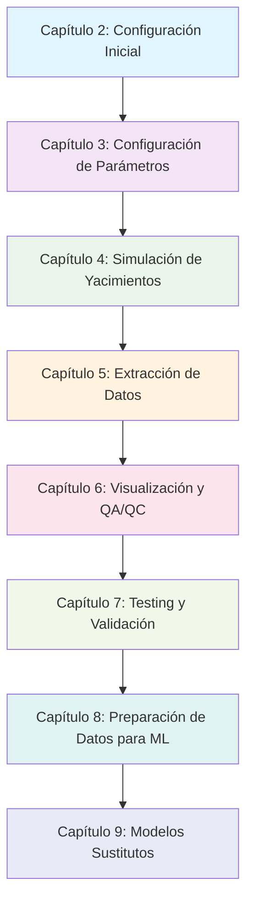

# GeomechML - Manual del Usuario

## Índice del Manual

Este manual está estructurado como un libro que sigue el mismo flujo de trabajo del proyecto GeomechML. Cada capítulo te guía paso a paso por el proceso completo desde la configuración inicial hasta la generación de modelos de machine learning.

### **Parte I: Fundamentos del Sistema**

#### [Capítulo 1: Introducción al Sistema](01_introduccion.md)
- ¿Qué es GeomechML?
- Arquitectura general del sistema
- Componentes principales (MRST + ML)
- Requisitos y dependencias

#### [Capítulo 2: Configuración Inicial](02_configuracion_inicial.md)
- Instalación de MRST y dependencias
- Estructura de directorios del proyecto
- Configuración de archivos YAML
- Verificación de la instalación

### **Parte II: Workflow de Simulación**

#### [Capítulo 3: Configuración de Parámetros](03_configuracion_parametros.md)
- Sistema de configuración YAML
- Parámetros de grid y geometría
- Propiedades de roca y fluidos
- Configuración de pozos y simulación

#### [Capítulo 4: Simulación de Yacimientos](04_simulacion_yacimientos.md)
- Workflow de simulación MRST
- Setup de campo y propiedades
- Ejecución de simulación
- Monitoreo y validación

#### [Capítulo 5: Extracción de Datos](05_extraccion_datos.md)
- Extracción de snapshots de simulación
- Formato de datos para ML
- Generación de metadata
- Validación de datasets

### **Parte III: Análisis y Validación**

#### [Capítulo 6: Visualización y QA/QC](06_visualizacion_qaqc.md)
- Sistema de visualización
- Análisis de resultados
- Control de calidad automático
- Generación de reportes

#### [Capítulo 7: Testing y Validación](07_testing_validacion.md)
- Sistema de pruebas automatizadas
- Validación de configuraciones
- Testing de workflow completo
- Debugging y troubleshooting

### **Parte IV: Machine Learning**

#### [Capítulo 8: Preparación de Datos para ML](08_preparacion_datos_ml.md)
- Carga de datasets en Python
- Normalización y preprocesamiento
- Formato para entrenamiento
- Validación de datos

#### [Capítulo 9: Modelos Sustitutos](09_modelos_sustitutos.md)
- Arquitecturas de modelos ML
- Entrenamiento de modelos
- Evaluación y validación
- Implementación en producción

### **Parte V: Casos de Uso y Ejemplos**

#### [Capítulo 10: Casos de Uso Prácticos](10_casos_uso.md)
- Ejemplo completo paso a paso
- Configuraciones típicas
- Análisis de resultados
- Mejores prácticas

#### [Capítulo 11: Troubleshooting y FAQ](11_troubleshooting_faq.md)
- Problemas comunes y soluciones
- Preguntas frecuentes
- Optimización de rendimiento
- Soporte técnico

---

## Cómo Usar Este Manual

### **Para Usuarios Nuevos**
1. Comienza con el **Capítulo 1** para entender el sistema
2. Sigue con el **Capítulo 2** para configurar tu entorno
3. Continúa secuencialmente hasta el **Capítulo 5** para ejecutar tu primera simulación

### **Para Usuarios Experimentados**
- Usa el índice para navegar a secciones específicas
- Consulta el **Capítulo 11** para troubleshooting rápido
- Revisa el **Capítulo 10** para casos de uso avanzados

### **Para Desarrolladores**
- Enfócate en los **Capítulos 7-9** para aspectos técnicos
- Consulta el código fuente referenciado en cada capítulo
- Usa las pruebas automatizadas para validar cambios

---

## Flujo de Trabajo del Proyecto



---

## Convenciones del Manual

### **Código y Comandos**
- `código inline` - Comandos cortos o nombres de archivos
- ```bloques de código``` - Scripts completos o ejemplos largos
- **Texto en negrita** - Conceptos importantes o nombres de archivos
- *Texto en cursiva* - Énfasis o términos técnicos

### **Iconos y Símbolos**
- ✅ **Éxito** - Pasos completados correctamente
- ⚠️ **Advertencia** - Precauciones importantes
- ❌ **Error** - Problemas comunes a evitar
- 💡 **Consejo** - Sugerencias útiles
- 🔧 **Configuración** - Ajustes necesarios

### **Referencias**
- Cada capítulo incluye referencias al código fuente
- Los ejemplos son ejecutables y verificados
- Los diagramas muestran el flujo real del sistema

---

*Manual GeomechML v1.0 - Simulación Geomecánica y Machine Learning* 